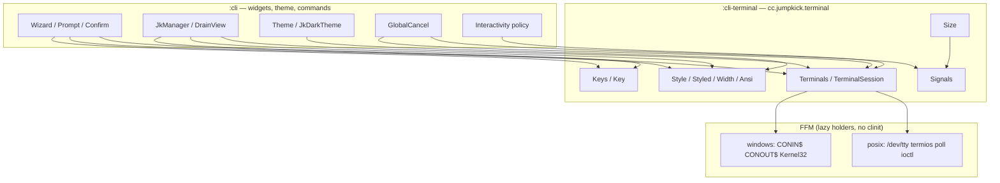
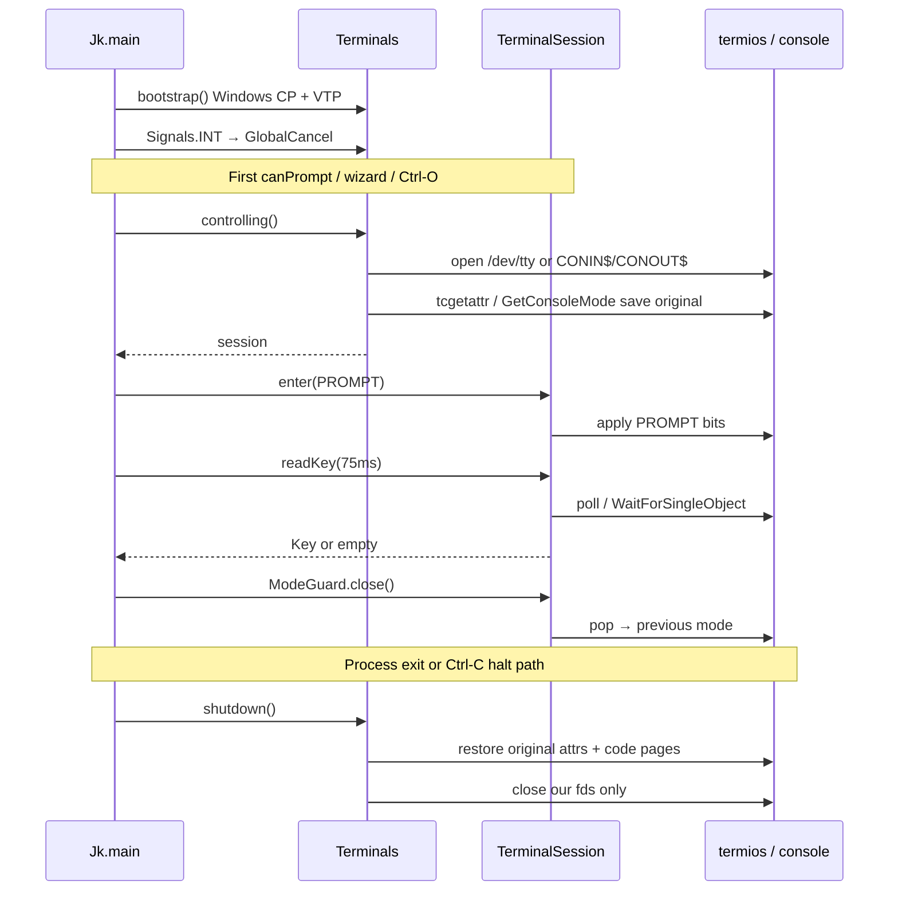
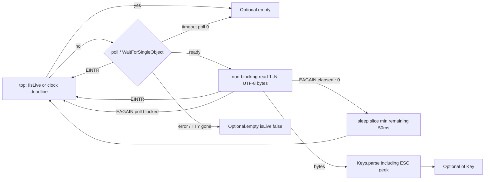

# `:cli-terminal` — Replace JLine Completely

| Field | Value |
|-------|--------|
| **Status** | Implemented |
| **Author** | — |
| **Date** | 2026-08-23 |
| **Audience** | Maintainers of `clients/cli` and the native-image client |
| **Scope** | Client-only. No wire, lockfile, engine, or plugin changes. Schema/protocol stay at 1. |

JumpKick is pre-1.0 and private. There is no compatibility contract with our own past. This campaign
deletes JLine from `:cli` in the same stack that lands the replacement — one design, one code path,
no shims, no `AttributedStyle` façade, no dual readers.

---

## Overview

`:cli` depends on `org.jline:jline-terminal-ffm:4.1.2` for a handful of terminal primitives:
open a system TTY, flip termios, timed key reads, SIGINT/SIGWINCH registration, and
`AttributedStyle` / `AttributedString` / `WCWidth`. Everything users see — Wizard, Prompt, Confirm,
JkWedge, Table, Tree, Spinner, JkManager, DrainView — is already ours. We do **not** use
LineReader, completers, history, widgets, Display, alt-screen, or terminfo. We *do* spend a
surprising amount of `:cli` code fighting JLine: it closes FD 0, probes DA/DECRQM/mode-2027,
installs `SIG_DFL`, parks a helper thread in `FileInputStream.read()`, rewrites box-drawing in
`toAnsi()`, emits color-first SGR, and pulls `capabilities.txt` / `*.caps` / `jline-native`
into the Graal image.

This document specifies the jk module **`:cli-terminal`** (`clients/cli-terminal/`,
package `cc.jumpkick.terminal`) that is the library we wished `jline-terminal` had been for us:
one controlling TTY independent of stdio redirection, named input modes, `poll` /
`WaitForSingleObject` timed reads, first-class Windows console, our own Style/width/keys, and
restore as a session invariant. `:cli` depends on it. Engine, plugins, and the wire never see it.
The branch merges to `main` only when `:cli`'s classpath contains **zero** JLine artifacts **and**
`docs/contributors/tui.md` matches the new implementation.

---

## Background & Motivation

### What JLine is used for today

`:cli` depends on `jk-cli-terminal` (`clients/cli/jk.toml`, workspace edge). There is no
`clients/cli/build.gradle.kts` and no root `gradle/libs.versions.toml`: the workspace is the
root `jk.toml`, and `.jk/after-build-dist.kts` assembles `target/dist`. `:cli` production
code imports no `org.jline` type (`SelfHostingTomlTest` asserts the merged main graph does
not contain `org.jline:jline-terminal-ffm`). `jk-lock.toml` still records `org.jline` through
Zinc (`org.scala-sbt.jline`). The catalog aliases `jline` and `jline-terminal-ffm` stay in
`shared/core/src/main/resources/cc/jumpkick/library/libraries.toml`, and the adopter template
`templates/java/none/cli-native.g8` pins `jline`.

**`org.jline` types `:cli` production code does not import** (the leaf owns this surface):

| JLine type | Callers | What we use |
|------------|---------|-------------|
| `TerminalBuilder` / `Terminal` | `Interactivity`, `Wizard`, `Prompt`, `JkManager`, `DrainView`, JDK wizards | One system terminal: `system(true)`, `enterRawMode`, `get/setAttributes`, `reader()`/`writer()`, `handle(INT)` |
| `Attributes` | `Interactivity`, `Wizard`, `JkManager.outputKeyListenerAttributes`, `DrainView` | ECHO, ICANON, IEXTEN, ISIG, VMIN, VTIME |
| `NonBlockingReader` | `KeyReader`, `Wizard.drainInput`, `Prompt`, `JkManager.readKeys`, `DrainView` | Timed poll (`read(timeoutMs)`, `peek`) |
| `AttributedStyle` / `AttributedString` / `AttributedStringBuilder` | `Theme`, `JkDarkTheme`, rails, wedges, syntax highlight, help, tables | Color + attributes; `toAnsi()` is **not** trusted |
| `WCWidth` | `JkManagerColor` | Truncation / CJK columns |
| `Signals.register` | `GlobalCancel` (INT), `TerminalSize` (WINCH) | Reflective `sun.misc.Signal` wrapper |
| `DumbTerminal` | `WizardTest` only | In-memory wizard tests |

**Not used:** `LineReader`, completers, history, widgets, `Display`/status/alt-screen, terminfo
capability lookup. Terminfo is still **baked into the native image** via

```
clients/cli/src/main/resources/META-INF/native-image/org.jline/jline-terminal-ffm/resource-config.json
```

which includes `org/jline/utils/capabilities.txt` and `org/jline/.*\.caps`.

### Workarounds that exist only because of JLine

These live in `:cli` today and must become first-class library behavior, not caller ritual.

1. **Shared system terminal singleton** — `Interactivity.sharedTerminal`. JLine's system terminal
   owns FD 0; `close()` closes stdin. A second `system(true)` falls back to dumb ("Stream Closed").
   Hence `takeSharedTerminal` / `returnSharedTerminal` (`Interactivity.java`).
2. **`graphemeCluster(false)`** — skip mode-2027 DECRQM+DA1. On a slow TTY the reply lands after
   JLine restores ECHO and flashes ANSI (`Interactivity.computeCanPrompt`).
3. **`nativeSignals(false)` + reinstall `GlobalCancel`** — JLine default is `SIG_DFL`, which
   replaces our Ctrl-C handler. `Terminal.handle` does not reliably restore `sun.misc.Signal`
   (`GlobalCancel`, `Wizard.run` finally).
4. **ECHO off + drain after `build()`** — hide DA/DECRQM replies (`Wizard.drainInput`).
5. **`StdinWake`** — our own FFM `fcntl` `O_NONBLOCK` pulse. JLine's NonBlocking helper thread
   parks in `FileInputStream.read()` on FD 0; on macOS close does not interrupt, and after ICANON
   the hang waits for **Enter** (`StdinWake.java`, `Wizard.unblockBlockingInput`).
6. **`unblockBlockingInput`** — force `VMIN=0`/`VTIME=0` *before* restoring ICANON.
7. **`prepareProcessExit`** — wake, restore, `close()` so JLine's shutdown closer is deregistered
   before `System.exit` (`Jk.main` finally; `GlobalCancel` before `halt(2)`).
8. **IEXTEN off** — macOS/Linux `VDISCARD` (Ctrl-O) must reach `KeyReader`
   (`JkManager.outputKeyListenerAttributes`, `OutputKeyListenerAttributesTest`).
9. **Keep ISIG on for live plans** — Ctrl-C is SIGINT, not a byte (`JkManager`, `DrainView`).
10. **Force UTF-8 on Windows** — `WindowsUtf8` Kernel32 FFM (CP 65001 + VTP + UTF-8 `PrintStream`s).
    JLine's OEM code-page auto-detect mangles `●`.
11. **`TerminalSize` already does `ioctl(TIOCGWINSZ)` / `GetConsoleScreenBufferInfo`** — JLine
    `getSize()` is unused. SIGWINCH via JLine `Signals` is the only remaining JLine piece.
12. **`Theme.colorize`** bypasses `AttributedString.toAnsi()` — that path rewrites box-drawing
    without a Terminal (`Theme.java` ~L377).
13. **SGR reorder** — `attributeLeading` because JLine emits color-first; jk's canonical order is
    attribute-leading (`1;38;2;…` not `38;2;…;1`).
14. **`gradientHeaderAnsi`** — `toAnsi` stamps bold only on the first char and relies on SGR
    persistence (`JkDarkTheme.gradientHeaderAnsi`).
15. **`RenderContext.stripAnsi`** — JLine `stripAnsi` leaves OSC (hyperlinks inflate width).
16. **Graal tax** — `-H:+SharedArenaSupport` (JLine signal handler `Arena.ofShared`),
    `--initialize-at-run-time=org.jline`, `-H:ExcludeResources=org/jline/nativ/.*`,
    plus our own `META-INF/native-image/org.jline/` hints. Nothing else in the tree uses
    `Arena.ofShared`.

`docs/contributors/tui.md` currently documents several of these as product facts ("Settle must
unblock JLine's stdin reader"). After this campaign that section describes `:cli-terminal`
invariants instead. The **user-visible** behavior (Ctrl-O peek, type-ahead consumption, envelope
blanks, nerd/ansi/plain, `canPrompt` vs `stdoutIsTty`, inheritIO skip trailing blank, Ctrl-C
never hangs) does not change.

### Why not "swap the backend and keep JLine types"

JLine's types *are* the problem. `AttributedStyle` forces a rewrite pass. `Terminal.close()`
closes FD 0. `NonBlockingReader` is a helper thread. `enterRawMode()` is a boolean, not the
four named modes we actually need. Keeping those types as a façade is the dual-path the
anti-goals forbid.

---

## Goals & Non-Goals

### Goals

- A client-only library, **`:cli-terminal`**, that owns **all** terminal-specific FFM and
  behavior (POSIX and Windows).
- One controlling TTY per process, independent of whether stdin/stdout/stderr are redirected.
  Closing a session **never** closes process FD 0/1/2. Singleton `close()` restores attrs and
  clears the mode stack; **only** `Terminals.shutdown()` closes *our* `/dev/tty` / `CONIN$`
  fds.
- Named input modes (`COOKED`, `PROMPT`, `PLAN_KEYS`, `INHERIT_CHILD`) with exact termios /
  console-mode bits (including `IXON` off so Ctrl-S cannot freeze a live plan).
- Timed key reads via **`poll`** (POSIX, fixed-arity, `captureCallState("errno")`) and
  `WaitForSingleObject` + `PeekConsoleInputW`/`ReadConsoleInputW` (Windows, UTF-8 bytes).
  POSIX `read` is `O_NONBLOCK`.
  `read` `EAGAIN` after `POLLIN` is not a timeout: the loop is **clock-driven** (deadline at
  the top of each iteration; a sleep slice if `poll` returned immediately). Forever waits
  (`Duration.ZERO`) have no deadline and still take the 50ms slice. No `ppoll`. No helper
  thread. Process exit never waits for Enter.
- No terminfo, no DA/DECRQM/grapheme probes, no capability flicker.
- Restore is a session invariant: mode stack + guaranteed restore on close, SIGINT/`halt(2)`,
  and JVM shutdown — **before** halt, without JLine shutdown hooks.
- Style, visible width (CSI **and** OSC), and key parsing are first-class in this module.
- Windows is a first-class backend (CP_UTF8, VTP, console mode, code-page restore).
- Native-image: `:cli-terminal` owns FFM downcalls and Graal hints. `:cli` drops every
  JLine-specific image arg. `--enable-native-access=ALL-UNNAMED` stays.
- `:cli` runtime classpath contains **zero** `org.jline` artifacts when the stack lands on `main`.
- Preserve product behavior in `docs/contributors/tui.md`.

### Non-Goals

- LineReader, completion, history, alt-screen, full-screen TUI, terminfo databases.
- Sharing this library with the engine, plugins, or workers. Engine never owns a TTY.
- A public Maven artifact / third-party terminal library. This is jk's client leaf.
- Cygwin/MSYS pty helper DLLs. Git-Bash/mintty degrades (see Windows policy).
- Emulating JLine's `Attributes` / `AttributedStyle` bit layouts.
- Changing the client↔engine wire, lockfile, or schema versions.
- Teaching JLine (or this library) in **user** docs. Contributor TUI guide only.
- Rewriting widgets (Wizard, JkWedge, Table, …) beyond swapping types they consume.

### Behavior changes we *do* accept (called out)

| Change | Why | User-visible? |
|--------|-----|----------------|
| `canPrompt()` is `isatty(/dev/tty)` / console attach, not `TerminalBuilder.system(true)` | Probe must not emit DA/DECRQM | No flicker; same yes/no in normal use |
| `stdoutIsTty()` prefers `isatty(1)` / console-mode on `STD_OUTPUT_HANDLE`, with `System.console()` as fallback **only** when FFM is unavailable | `System.console()` is null when **stdin** is redirected even if stdout is a TTY, so `jk build < /dev/null` currently will not animate | **Yes, improvement:** stdin-redirected interactive runs may now animate. Piped/redirected **stdout** still does not. Flush policy (Windows UTF-8 stream buffer size / autoflush) follows `stdoutIsTty()`, **not** `System.console()` — otherwise live regions would “animate” into an 8 KiB buffer and look stuck. |
| Wizard Ctrl-C is a **byte** (`PROMPT` has ISIG off), not `Terminal.handle(INT)` | Eliminates JLine signal round-trip; `GlobalCancel` stays installed and simply does not fire from the TTY during a wizard | Same: wizard cancels; no `halt(2)` from GlobalCancel inside a wizard |
| `PROMPT` / `PLAN_KEYS` clear `IXON` (and `IXOFF`/`ICRNL`/`INLCR`) | JLine `enterRawMode()` already does this for Wizard; `JkManager.outputKeyListenerAttributes` currently does **not**, so Ctrl-S can XOFF a live plan | **Yes, fix:** Ctrl-S during `jk build` is a consumed byte, not a freeze. |
| COOKED / inheritIO restore the **open-time snapshot**, not `Wizard.restoreCooked`'s force-ECHO+ICANON | Snapshot is parent-shell state captured at `/dev/tty` open | Same in the normal case (parent had echo/canon on). If someone launched jk with echo already off, we put it back that way instead of forcing on. |
| `halt(2)` restores Windows code pages if still 65001 | Today CP restore is a shutdown hook that `halt` skips; `prepareProcessExit` only restores termios | **Yes, improvement** on Windows Ctrl-C: the tab's OEM page comes back. VTP stays enabled. |
| No JLine `toAnsi` box-drawing rewrite, ever | We already bypass it | None (we already fought this) |
| Git-Bash/mintty (Win32 `jk.exe`, pipe stdio, no console) → `canPrompt=false` | We will not ship a Cygwin PTY helper | Wizards/Ctrl-O unavailable there; Windows Terminal / conhost / ConPTY remain first-class |
| Prompt/Confirm stay on **stderr** (`CliOutput.stderr()`), not `ttyOut()` | Today `Prompt.ask` paints stderr (`Prompt.java` L82–85); Wizard paints the controlling TTY writer | **None.** `jk foo 2>err.log` still captures prompts. `ttyOut()` is Wizard / DrainView / JkManager chrome on the controlling TTY so `jk init \| less` still shows the wizard. |

If `isatty(1)` proves to animate in a case `tui.md` wants plain, we keep the split and tighten
the probe — we do **not** collapse `canPrompt` and `stdoutIsTty`.

---

## Key Decisions

1. **New module, new package, JDK-only leaf.** Path `clients/cli-terminal/`, jk name
   `jk-cli-terminal`, package `cc.jumpkick.terminal`. Zero
   dependency on `:cli`, `:wire`, `:jk-api`, `:toolchain-jdk`, theme, or commands.
   **`HostPlatform` is forbidden** in the leaf (`WindowsUtf8` today imports it — replace with
   `Os.isWindows()` / `isDarwin()` / `isLinux()`; no `currentOs()`/`currentArch()`). Nullness is the module's `[javac]` Error Prone table. Only `:cli`
   may depend on it. After the campaign, `rg 'java.lang.foreign' clients/cli/src/main` is empty
   (FFM lives only in the leaf; the **image** still passes `--enable-native-access` because it
   links the leaf). `rg 'org.jline' clients/cli` is empty except `templates/` (out of that
   glob). `rg 'cc.jumpkick.terminal' server plugins` is empty.
   *Rationale:* a leaf cannot grow CLI-shaped imports; engine/plugin leakage is a layering bug.

2. **One process-wide `TerminalSession`, opened against `/dev/tty` or `CONIN$`/`CONOUT$`, never
   against FD 0/1/2.** Singleton `close()` restores original attributes, **clears the mode
   stack**, keeps native fds open, and leaves `isLive` unchanged. **`Terminals.shutdown()` is
   the only closer of our `/dev/tty` / `CONIN$`/`CONOUT$` fds** (and the only path that sets
   `isLive=false` on the singleton). Process FD 0/1/2 are never ours to close. Matches the
   `TerminalSession.close()` table below; do not implement `NativeTerminal.close()` as
   `close(fd)`. *Rationale:* the entire `Interactivity` shared-terminal dance exists because
   JLine closes FD 0. Opening the controlling TTY ourselves makes that class a policy wrapper.

3. **Named `InputMode`, not `enterRawMode()`.** Four modes (`COOKED`, `PROMPT`, `PLAN_KEYS`,
   `INHERIT_CHILD`) with exact POSIX and Windows bits below. Mode changes are a stack owned by
   the session. *Rationale:* Wizard, live-plan Ctrl-O, and `jk run` inheritIO are three different
   line-discipline contracts that a boolean cannot express.

4. **Timed reads via `poll` / `WaitForSingleObject`+`PeekConsoleInputW`. No helper thread. Delete
   `StdinWake`.** VMIN=1, VTIME=0 on the TTY (termios). POSIX **`read` never blocks**: the
   session's `/dev/tty` fd is `O_NONBLOCK` for its lifetime (private reader detail on **all
   POSIX**, not a public `pulseNonBlocking()`). The wait loop is **clock-driven**, not
   `poll`-return-driven:
   1. **Top of each iteration:** if `!isLive` → empty. If the call is timed (`timeout` not
      `Duration.ZERO`) and `nanoTime() >= deadline` → empty, `isLive` unchanged — even if
      the last `poll` was `>0` + `EAGAIN`. `Duration.ZERO` (`Prompt.ask`) is **forever**:
      no this-row timeout (`poll(-1)` / `WaitForSingleObject(INFINITE)`).
   2. After `POLLIN`, `read` `EAGAIN`/`EWOULDBLOCK` is **not** empty. If that `poll`
      returned immediately (elapsed &lt; 1ms — spurious Darwin `POLLIN`), **do not
      tight-restart `poll`**: `clock_nanosleep(CLOCK_MONOTONIC)` a slice —
      `min(remaining, 50ms)` when timed, **50ms** when forever — then recheck `!isLive`
      and the deadline. If `poll` actually blocked, restarting `poll(remaining)` is fine.
   3. Empty when the **deadline passed**, `poll` returned 0, or `!isLive`. `isLive`
      unchanged on `EAGAIN`. Same loop for the ESC 50ms peek and CSI 1ms peeks.
   Windows input is **UTF-8 bytes** (`SetConsoleCP(65001)` + `PeekConsoleInputW` /
   `ReadConsoleInputW` on `CONIN$`, KEY_EVENT → UTF-8/CSI) into the same `Keys` parser as
   POSIX. Never `ReadFile`/`ReadConsoleW` on `CONIN$`.
   Do **not** hold the session lock across `poll`/`WaitForSingleObject`/`read`/the slice.
   *Rationale:* blocking `read` after ICANON is the macOS Enter-hang; treating spurious
   `EAGAIN` as empty busy-spins the wizard; restarting `poll` with no clock exit
   **never returns** when Darwin `poll` never returns 0 — including `poll(-1)` forever.

5. **No terminfo, no DA/DECRQM, no grapheme probes.** Size is ioctl / `GetConsoleScreenBufferInfo`
   + `$COLUMNS`/`$LINES` + SIGWINCH invalidation (today's `TerminalSize`). Emission is the known
   VT set in `Ansi`. *Rationale:* jk already does this; JLine's probes are pure cost and flicker.

6. **Style is ours, attribute-leading SGR only, never rewrite glyphs.** `Style` / `Styled` /
   `StyledBuilder` / `Width` replace `AttributedStyle` / `AttributedString` /
   `AttributedStringBuilder` / `WCWidth`. `Style` has **strike** (`crossedOut()`, SGR 9) so
   `RichText`, `SpinnerProgressBar.dim().crossedOut()`, and `ExplainCommand` type-check.
   `Theme` stays in `:cli` as **color choices** and returns `cc.jumpkick.terminal.Style`.
   **`Rgb` stays in `cc.jumpkick.cli.theme`.** The leaf is palette-free (`RgbInts` is
   internal to `Style`). Move a tiny `Rgb` into `:cli-terminal` later only if Theme
   conversion is noisy — not in this campaign.
   CSI/cursor/`hyperlink` primitives move with `Ansi`; **OSC enable** stays in `:cli` as
   `cc.jumpkick.cli.api.Osc` (the leaf must not read `SessionContext`).
   *Rationale:* every `Theme.colorize` / `attributeLeading` / `gradientHeaderAnsi` /
   `stripAnsi` workaround is a Style-API defect; dropping SGR 9 is not a subset, it is a miss.

7. **Keys move into `:cli-terminal`; widgets stay in `:cli`.** Today's `KeyReader.Key` sealed
   hierarchy is terminal protocol (CSI arrows, ESC timeout, Ctrl-O/C/X). **One public timed
   read:** `TerminalSession.readKey(Duration)`. `Keys` is package-private parse. *Rationale:*
   two public entry points will fork ESC-peek behavior; the parser has no theme/command knowledge.

8. **Signals: one `sun.misc.Signal` wrapper in `:cli-terminal`. No FFM `sigaction`. No
   `Arena.ofShared`.** Same reflective trick JLine's `Signals` uses, so javac does not see the
   internal API. **Windows Ctrl-C is `sun.misc.Signal("INT")`** (JVM console mapping when
   processed input is on). Do **not** add `SetConsoleCtrlHandler` in this campaign. Add it
   **only after** Windows native-image dogfood proves `Signal("INT")` does not fire under
   `PLAN_KEYS`. We do not take `SIG_DFL`. Drop `-H:+SharedArenaSupport` if nothing else
   needs it (nothing else in the tree does). *Rationale:* FFM upcalls are why JLine needs
   SharedArena; we do not need them to register INT/WINCH.

9. **Windows is CONIN$/CONOUT$ + VTP + CP 65001, with an explicit degradation matrix.** Not
   JLine's win-sys / ConEmu / Cygwin matrix. Git-Bash/mintty without a real console → dumb
   (cannot prompt). ConPTY / Windows Terminal → full. Restore session code pages on exit;
   leave VTP enabled (today's `WindowsUtf8` contract).

10. **In-memory `MemoryTerminal` is a first-class backend, not a JLine leftover.** Wizard and
    Key tests never require a real TTY. Integration tests may use a pty where available.

11. **User template `cli-native.g8` keeps teaching JLine LineReader.** That template is a
    *user* REPL scaffold (completion, history) unrelated to jk internals. Catalog aliases
    `jline` / `jline-terminal-ffm` stay in `libraries.toml` for adopters. They are not a
    dependency of `:cli`. *Rationale:* do not silently keep JLine on our client
    because of a template; do not rip LineReader out of a template that actually needs it.

12. **Land on `main` only when JLine is gone from `:cli` and contributor TUI docs match.**
    Stacked commits on a branch; intermediate JLine+leaf classpath is **branch-only**. Merge
    after the docs commit (`tui.md`, architecture map, README row). Do not merge after the
    Graal/JLine-delete commit while `tui.md` still talks about NonBlocking readers.

---

## Proposed Design

### Module layout

```
clients/cli-terminal/
  jk.toml
  src/main/java/cc/jumpkick/terminal/
    package-info.java          @NullMarked
    Terminals.java             process façade
    TerminalSession.java       sealed interface
    NativeTerminal.java        thin dispatcher + mode stack + isLive + lock (<200 lines)
    MemoryTerminal.java        public test backend (AutoCloseable owner)
    InputMode.java             enum
    ModeGuard.java             AutoCloseable stack frame
    Key.java                   sealed key types (moved from KeyReader.Key)
    Keys.java                  package-private parser
    Style.java                 immutable SGR including strike
    Styled.java                span list
    StyledBuilder.java
    Width.java                 wcwidth + CSI/OSC strip
    Ansi.java                  CSI/OSC constructors (no SessionContext)
    Size.java                  moved from TerminalSize (no JLine Signals)
    Signals.java               sun.misc.Signal wrapper
  src/main/java/cc/jumpkick/terminal/posix/
    PosixTty.java              open /dev/tty, poll, read, write, tcsetattr
    TermiosLinux.java          glibc struct layout + flag constants
    TermiosDarwin.java         Darwin LP64 struct layout + flag constants
  src/main/java/cc/jumpkick/terminal/windows/
    WindowsConsole.java        CONIN$/CONOUT$ CreateFile, mode, wait, PeekConsoleInput/WriteFile
    WindowsUtf8.java           CP 65001 + VTP + UTF-8 streams (no HostPlatform)
  src/main/resources/META-INF/native-image/cc.jumpkick/cli-terminal/
    reachability-metadata.json sun.misc.Signal + SignalHandler (commit 1)
  src/test/java/…
```

**File-size split is load-bearing.** Soft 400 / hard 800 (`docs/contributors/code-as-art.md`).
`NativeTerminal` is a dispatcher: mode stack, `ReentrantLock`, `isLive`, delegating to
`PosixTty` or `WindowsConsole`. It must not absorb FFM, termios layouts, or Windows bootstrap.
`TermiosLinux` and `TermiosDarwin` are layout-only (do not merge into one 800-line `Termios`).
`WindowsUtf8` stays CP/VTP/streams; `WindowsConsole` stays handles/mode/I/O.

`clients/cli-terminal/jk.toml` names `jk-cli-terminal`, sets `java = 25`, and depends on
`jk-host`. `clients/cli/jk.toml` depends on `jk-cli-terminal` (workspace edge) and passes
`--enable-native-access=ALL-UNNAMED` in `[native] args`. Both modules are in the root
`jk.toml` `[workspace] modules`. Nullness is each module's own `[javac]` Error Prone table.

**Who may depend:** `:cli` only. `cli-runtime-classpath` bans `org.jline:*` on `:cli`'s
runtime dependencies. `cli-runtime-modules` is the closed client layer `:cli` links,
`jk-cli-terminal` included.

Package `cc.jumpkick.terminal` is deliberate: not `cc.jumpkick.cli.tui`. The library is a
leaf. Putting it under `cli.tui` would invite `:cli` internals to leak in.

Java 25 (client native image). Not Java 17 — workers never load this. Do not copy
`shared/host/jk.toml`'s `java = 17`.

### Layering



Engine, wire, plugins: no edge to `:cli-terminal`.

### Session lifetime



### Public API

All types below live in `cc.jumpkick.terminal`. New packages are `@NullMarked`. Unannotated
means non-null; `@Nullable` on every type use that can be null.

#### `Terminals`

```java
package cc.jumpkick.terminal;

import java.io.InputStream;
import java.io.OutputStream;
import org.jspecify.annotations.Nullable;

/**
 * Process façade. One controlling TTY. Never owns FD 0/1/2 of the process.
 */
public final class Terminals {
    private Terminals() {}

    /**
     * Windows: CP 65001, VTP, UTF-8 System.out/err. POSIX: no-op.
     * Call from {@code Jk.main} before the first write. Idempotent.
     */
    public static void bootstrap() {}

    /**
     * The process-wide controlling TTY, opened lazily.
     * Returns a live session when {@code /dev/tty} or a Windows console is reachable;
     * otherwise a non-live session whose {@link TerminalSession#isLive()} is false
     * and whose enter/read are no-ops (same role as today's dumb reject).
     */
    public static TerminalSession controlling() {
        throw new AssertionError("spec");
    }

    /**
     * Input axis. False when {@code CI} / {@code JK_NONINTERACTIVE} / {@code TERM=dumb}
     * (those gates live in {@code Interactivity}, which calls this only after).
     * Implementation: POSIX {@code isatty} on a private {@code /dev/tty} fd;
     * Windows {@code GetConsoleMode} on {@code CONIN$}. Does not emit bytes.
     */
    public static boolean controllingIsTty() {
        throw new AssertionError("spec");
    }

    /**
     * Output axis for animation. POSIX {@code isatty(1)}; Windows {@code GetConsoleMode}
     * on {@code STD_OUTPUT_HANDLE}. Does not consult the controlling TTY.
     * Fallback when FFM is unavailable: {@code System.console() != null} (today's probe —
     * false when stdin is redirected). Documented here so this javadoc and the accepted-
     * behavior table stay one fact. Flush policy for {@code WindowsUtf8} streams follows
     * <em>this</em> method, never {@code System.console()} directly.
     */
    public static boolean stdoutIsTty() {
        throw new AssertionError("spec");
    }

    /** In-memory backend for unit tests. {@code enter} is a no-op on attributes. */
    public static MemoryTerminal memory(InputStream in, OutputStream out) {
        throw new AssertionError("spec");
    }

    /**
     * Restore original attrs + Windows code pages (if still 65001), close <em>our</em>
     * fds, drop the singleton, {@code isLive=false}. Safe when nothing was opened.
     * Must return quickly — {@code GlobalCancel} joins this for 500ms then {@code halt(2)}.
     * The only closer of native fds. Do not also register a WindowsUtf8 shutdown hook —
     * that hook would race this and is skipped by {@code halt} anyway.
     */
    public static void shutdown() {}

    /**
     * Apply the original snapshot (same bits as {@link InputMode#INHERIT_CHILD}), clear
     * the mode stack, so an {@code inheritIO} child sees a normal tty.
     * <strong>No-op when no session has been opened</strong> — safe to call from
     * Mvn/Gradle later; {@code RunCommand} / {@code JshellCommand} / {@code ShellCommand} /
     * {@code ScriptRunner} / {@code AppWatchLoop} call it immediately before inheritIO.
     */
    public static void restoreForChild() {}
}
```

`AssertionError("spec")` above is documentation-only — the implementation returns real values.

**Production callers never `try-with-resources` the singleton.** Today's
`Prompt.ask` / `JdkInstallCommand` `try (Terminal t = Wizard.openTerminal())` would, if
translated to `try (TerminalSession tty = Terminals.controlling())`, restore the stack and
(if `close()` were allowed to drop `isLive`) kill Ctrl-O for the rest of the process.
The shape is:

```java
TerminalSession tty = Terminals.controlling();
if (!tty.isLive()) { /* cooked fallback */ return; }
try (ModeGuard raw = tty.enter(InputMode.PROMPT)) {
    Optional<Key> k = tty.readKey(Duration.ofMillis(75));
    tty.ttyOut().print(Style.EMPTY.bold().foreground(0, 188, 212).render("hello"));
} // previous mode restored; session still live; fds still ours
```

**Only `MemoryTerminal` is owned with try-with-resources** (`Terminals.memory(...)`).
`Jk.main` finally and `GlobalCancel` call `Terminals.shutdown()`.

#### `Os`

Tiny `os.name` helper. **No** `currentOs()` / `currentArch()` strings, **no**
`cc.jumpkick.jdk.HostPlatform`.

```java
package cc.jumpkick.terminal;

import java.util.Locale;

/**
 * Host OS for TTY binders. Leaf-local — {@code HostPlatform} is forbidden here.
 */
public final class Os {
    private Os() {}

    /** {@code os.name} lowercased contains {@code "windows"} — not {@code "win"}, which matches {@code Darwin}. */
    public static boolean isWindows() {
        return name().contains("windows");
    }

    /** {@code os.name} starts with {@code Mac} or {@code Darwin} (termios / {@code O_CLOEXEC} / {@code nfds_t}). */
    public static boolean isDarwin() {
        String n = System.getProperty("os.name", "");
        return n.startsWith("Mac") || n.startsWith("Darwin");
    }

    /** {@code os.name} starts with {@code Linux}. */
    public static boolean isLinux() {
        return System.getProperty("os.name", "").startsWith("Linux");
    }

    private static String name() {
        return System.getProperty("os.name", "").toLowerCase(Locale.ROOT);
    }
}
```

`PosixTty` selects `TermiosLinux` vs `TermiosDarwin` via `isLinux()` / `isDarwin()`.
FreeBSD is **not** Darwin: no `TermiosFreeBSD` in this campaign (session non-live if
neither Linux nor Darwin). `Size` still uses Darwin `TIOCGWINSZ` `0x40087468` when
`os.name` starts with `FreeBSD` / `Mac` / `Darwin`, matching today's
`TerminalSize.tiocgwinszConstant`. No `HostPlatform.currentArch()` — mips/ppc/sparc
`TIOCGWINSZ` stays a local `os.arch` check inside `Size` as today.

`TerminalSession.close()` on the **singleton**:

| Action | Singleton `close()` | `Terminals.shutdown()` | `MemoryTerminal.close()` |
|--------|---------------------|------------------------|--------------------------|
| Restore original attrs | yes | yes | n/a |
| Clear mode stack | yes | yes | yes |
| `isLive()` | **unchanged** (true if TTY still exists) | **false** | **false** |
| Close native `/dev/tty` / `CONIN$` fds | **no** | **yes** | n/a (close the pipes) |
| Close process FD 0/1/2 | **never** | **never** | never |

`ModeGuard.close()` after `close()`/`shutdown()` is a documented **no-op** (stack already
empty; do not re-apply a stale `PLAN_KEYS`). Nested singleton `close()` is idempotent.

#### `InputMode` — exact bits

```java
public enum InputMode {
    /** Parent-shell restore: ICANON+ECHO+IEXTEN+ISIG as originally saved. */
    COOKED,
    /** Wizard / Prompt: cbreak, no echo, IEXTEN off, ISIG off (Ctrl-C is 0x03). */
    PROMPT,
    /** Live plan / DrainView: cbreak, no echo, IEXTEN off, ISIG on (Ctrl-C is SIGINT). */
    PLAN_KEYS,
    /** {@code inheritIO} child: fully cooked + echo from the original snapshot. */
    INHERIT_CHILD
}
```

`COOKED` vs `INHERIT_CHILD`: **identical bits** — both restore the **original** snapshot
captured at session open (not `Wizard.restoreCooked`'s force-ECHO+ICANON). They must not
diverge. `INHERIT_CHILD` exists as a named mode so callers cannot forget *why* they are
restoring. `COOKED` is what `ModeGuard.close()` pops to when the stack is empty.
`MvnCommand` / `GradleCommand` / `SelfCommand` also `inheritIO()` but do not currently
restore; they usually have not run a `canPrompt` probe. Leave that gap; `restoreForChild()`
is a no-op without a session so adding it later is safe.

**POSIX (`termios.c_lflag` / `c_iflag` / `c_cc`)** — apply on the `/dev/tty` fd, not on FD 0:

| Mode | ICANON | ECHO | IEXTEN | ISIG | IXON / IXOFF / ICRNL / INLCR | VMIN | VTIME |
|------|--------|------|--------|------|------------------------------|------|-------|
| `COOKED` / `INHERIT_CHILD` | original | original | original | original | original | original | original |
| `PROMPT` | off | off | **off** | **off** | **off** | 1 | 0 |
| `PLAN_KEYS` | off | off | **off** | **on** | **off** | 1 | 0 |

`IEXTEN` off is required on Darwin **and** Linux so `VDISCARD` (typically Ctrl-O,
`c_cc[VDISCARD]=0x0F`) does not swallow the peek key. `IXON` off is required so Ctrl-S
cannot XOFF the live plan / wizard (JLine `enterRawMode()` already clears it for Wizard;
`JkManager.outputKeyListenerAttributes` currently does not — this campaign fixes that).
Leave **`OPOST`/`ONLCR` as saved** (typically on) so `\n` on `ttyOut()` still becomes
CRLF; we do not emulate JLine's `~OPOST`. Do not touch `c_cflag` or baud.

Open: `open("/dev/tty", O_RDWR | O_CLOEXEC)` — `O_RDWR` so `ttyOut()` can write;
`O_CLOEXEC` so inheritIO children do not inherit an extra TTY fd. Then immediately
`fcntl(fd, F_GETFL)` / `fcntl(fd, F_SETFL, flags | O_NONBLOCK)` — **private POSIX
reader/writer detail on Linux and Darwin**, lifetime of the session, never on process FD 0.
Do **not** clear `O_NONBLOCK` around `ttyOut()` writes (that races `readKey`). `StdinWake`
is deleted; there is no public `pulseNonBlocking()`. `TerminalSize` today uses
`O_RDONLY=0` for a throwaway ioctl; that is the wrong open for a session.

| Constant | Linux | Darwin |
|----------|-------|--------|
| `O_RDWR` | `2` | `2` |
| `O_CLOEXEC` | `02000000` octal (`0x80000`) | `0x01000000` |
| `O_NONBLOCK` | `04000` octal (`0x800`) | `0x0004` |
| `F_GETFL` | `3` | `3` |
| `F_SETFL` | `4` | `4` |
| `ECHO` | `0000010` octal | `0x00000008` |
| `ICANON` | `0000002` | `0x00000100` |
| `ISIG` | `0000001` | `0x00000080` |
| `IEXTEN` | `0100000` | `0x00000400` |
| `IXON` | `0002000` octal | `0x00000200` |
| `IXOFF` | `0001000` octal | `0x00000400` |
| `ICRNL` | `0000400` octal | `0x00000100` |
| `INLCR` | `0000100` octal | `0x00000040` |
| `VMIN` index | 6 | 16 |
| `VTIME` index | 5 | 17 |
| `NCCS` | 32 | 20 |
| `tcflag_t` | `unsigned int` (4) | `unsigned long` (8, LP64) |
| `TCSANOW` | 0 | 0 |
| `POLLIN` | `0x0001` | `0x0001` |
| `POLLOUT` | `0x0004` | `0x0004` |
| `CLOCK_MONOTONIC` | `1` | `6` |
| `EINTR` | `4` | `4` |
| `EAGAIN` | `11` | `35` |
| `EWOULDBLOCK` | `11` (same as `EAGAIN`) | `35` (same as `EAGAIN`) |
| `EBADF` | `9` | `9` |

Mode-bits tests: given original `IXON` on, `PLAN_KEYS` has `IXON` off; given original
`IEXTEN` on, `PLAN_KEYS` has `IEXTEN` off and `ISIG` on.

##### `struct termios` layouts (not `winsize`)

`TerminalSize` only lays out `struct winsize` (four `ushort`s at 0/2). Termios is a
different struct. Bind these exactly:

**Linux glibc LP64** (`TermiosLinux`, `NCCS=32`, `sizeof=60`):

| Field | Type | Size | Offset |
|-------|------|------|--------|
| `c_iflag` | `tcflag_t` (`u32`) | 4 | 0 |
| `c_oflag` | `tcflag_t` | 4 | 4 |
| `c_cflag` | `tcflag_t` | 4 | 8 |
| `c_lflag` | `tcflag_t` | 4 | 12 |
| `c_line` | `cc_t` | 1 | 16 |
| `c_cc` | `cc_t[32]` | 32 | 17 |
| *(pad to 4)* | | 3 | 49 |
| `c_ispeed` | `speed_t` (`u32`) | 4 | 52 |
| `c_ospeed` | `speed_t` | 4 | 56 |

**Darwin LP64** (`TermiosDarwin`, `NCCS=20`, **no** `c_line`, `sizeof=72`):

| Field | Type | Size | Offset |
|-------|------|------|--------|
| `c_iflag` | `tcflag_t` (`unsigned long`) | 8 | 0 |
| `c_oflag` | `tcflag_t` | 8 | 8 |
| `c_cflag` | `tcflag_t` | 8 | 16 |
| `c_lflag` | `tcflag_t` | 8 | 24 |
| `c_cc` | `cc_t[20]` | 20 | 32 |
| *(pad to 8)* | | 4 | 52 |
| `c_ispeed` | `speed_t` (`unsigned long`) | 8 | 56 |
| `c_ospeed` | `speed_t` | 8 | 64 |

Read the whole struct with `tcgetattr`, mutate `c_lflag` / `c_iflag` / `c_cc[VMIN]` /
`c_cc[VTIME]`, write it back with `tcsetattr(fd, TCSANOW, ...)`. Speeds and `c_line` round-trip
unchanged. `tcgetattr`/`tcsetattr` are **not** variadic.

##### `poll` (fixed-arity — **not** variadic) + errno capture

Goals mentioned `ppoll`; **we do not use `ppoll`.** `poll` is:

```
int poll(struct pollfd *fds, nfds_t nfds, int timeout);
```

No `Linker.Option.firstVariadicArg` on `poll`. Only `ioctl` and `fcntl` are variadic (Darwin
AArch64 stack convention — keep `firstVariadicArg(2)` on those two, as `StdinWake` documents).

**FFM does not update a Java-visible `errno` unless the handle is bound with
`Linker.Option.captureCallState("errno")`.** Today's `TerminalSize` ioctl treats nonzero rc
as failure and never captures errno. The EINTR restart rule is unimplemented without this.

`poll` downcall (POSIX binders in `PosixTty`):

```java
Linker linker = Linker.nativeLinker();
StructLayout captured = Linker.Option.captureStateLayout();
MethodHandle poll = linker.downcallHandle(
        linker.defaultLookup().findOrThrow("poll"),
        FunctionDescriptor.of(
                ValueLayout.JAVA_INT,
                ValueLayout.ADDRESS,   // struct pollfd *
                nfdsLayout,            // Linux JAVA_LONG; Darwin JAVA_INT
                ValueLayout.JAVA_INT), // timeout ms; -1 forever
        Linker.Option.captureCallState("errno"));
// invokeExact leading arg is the capture MemorySegment:
try (Arena arena = Arena.ofConfined()) {
    MemorySegment state = arena.allocate(captured);
    MemorySegment fds = /* pollfd */;
    int rc = (int) poll.invokeExact(state, fds, nfdsOne, timeoutMs);
    if (rc < 0) {
        int errno = (int) captured.varHandle(MemoryLayout.PathElement.groupElement("errno"))
                .get(state, 0L);
        if (errno == EINTR) { /* restart until original deadline */ }
        else { /* EBADF / other → isLive=false, empty */ }
    }
}
```

Same `captureCallState("errno")` on **`read`**, **`write`**, and **`tcsetattr`** (all can
return `EINTR`; `read`/`write` also return `EAGAIN` under `O_NONBLOCK`).

**`poll` / `read` wait loop — clock-driven.** `Duration.ZERO` is forever (no deadline).
Otherwise `deadlineNanos = System.nanoTime() + timeout.toNanos()`.

Each iteration, **in this order**:

1. If `!isLive` → empty.
2. If timed and `System.nanoTime() >= deadlineNanos` → empty, `isLive` unchanged
   (even if the last `poll` was `>0` and `read` was `EAGAIN`).
3. `remainingNanos = timed ? max(0, deadlineNanos - now) : unbounded`.
   `poll` timeout = forever ? `-1` : `(int) (remainingNanos / 1_000_000)` (0 if
   remaining &lt; 1ms).
4. `t0 = nanoTime()`; `poll`; `elapsedNanos = nanoTime() - t0`. Then:

| Result | Action | `isLive` |
|--------|--------|----------|
| `poll` returns `0` | empty | unchanged |
| `poll` `-1` / `EINTR` | next iteration (step 1) | unchanged |
| `poll` `-1` / other (`EBADF`, …) | empty | **false** |
| `poll` `>0` then `read` `>0` | parse bytes | unchanged |
| `poll` `>0` then `read` `-1` / `EINTR` | next iteration | unchanged |
| `poll` `>0` then `read` `-1` / `EAGAIN`/`EWOULDBLOCK` | **not empty.** If `elapsedNanos < 1_000_000` (poll did not block): sleep a **slice** then next iteration. If poll actually blocked: next iteration (restart `poll(remaining)`). | unchanged |
| `poll` `>0` then `read` `-1` / other | empty | **false** |

**Slice** after immediate `EAGAIN`: `min(remainingNanos, 50ms)` when timed; **50ms** when
forever. Sleep with `clock_nanosleep(CLOCK_MONOTONIC, 0, timespec)` (relative; restart
the sleep on `EINTR` until the slice elapses or the deadline passes). `LockSupport.parkNanos`
is an acceptable equivalent (use it on Windows). Do **not** `poll` the TTY as the slice.
Do **not** tight-restart `poll` when elapsed ≈ 0 — that is the Darwin spurious-`POLLIN`
busy-spin (`readKey(75ms)` never hits `poll` returning 0; `readKey(Duration.ZERO)` /
`poll(-1)` is unbounded 100% CPU).

Empty when the **deadline passed**, `poll` returned 0, or `!isLive`. `EAGAIN` after
`POLLIN` is **not** a timeout. Same loop for the ESC 50ms peek and 1ms trailing CSI
peeks (their `deadlineNanos` is the peek window). Peek `EAGAIN` is not “bare ESC”
until that peek's **clock** expires.

`clock_nanosleep` is fixed-arity + `captureCallState("errno")`. `struct timespec` LP64:
`tv_sec` `time_t` 8 at 0, `tv_nsec` `long` 8 at 8. `CLOCK_MONOTONIC` in the constant
table (Linux `1`, Darwin `6` — not the same value).

`struct pollfd` (Linux and Darwin, 8 bytes):

| Field | Type | Size | Offset |
|-------|------|------|--------|
| `fd` | `int` | 4 | 0 |
| `events` | `short` | 2 | 4 |
| `revents` | `short` | 2 | 6 |

`nfds_t`: Linux `unsigned long`; Darwin `unsigned int`. Pass `1` via the matching
`ValueLayout`. `timeout` is `int` milliseconds; `-1` waits forever.

**EINTR:** SIGWINCH during `readKey` makes `poll` (or `clock_nanosleep`) return `-1`
with captured errno `EINTR` (4). Next iteration: the **clock** at step 1–2 decides
timeout; do not treat EINTR as `Optional.empty()` — that would drop a key that arrived
in the same window. The WINCH handler only bumps `Size`'s generation (never probes,
never takes the session lock). After `shutdown()`, do **not** restart: `!isLive` → empty.

`TIOCGWINSZ` stays as today's `TerminalSize`: `0x5413` Linux x86/arm, `0x40087468` Darwin /
Linux mips/ppc/sparc / FreeBSD; `ioctl` variadic with `firstVariadicArg(2)`.

**Windows console mode — input** (`GetConsoleMode` / `SetConsoleMode` on session `CONIN$`):

Start from the **original** `GetConsoleMode(conIn)` snapshot taken at open. Flip **only**
the four named bits below. **Leave every other bit as saved** — including
`ENABLE_QUICK_EDIT_MODE` (`0x40`), `ENABLE_EXTENDED_FLAGS` (`0x80`), `ENABLE_MOUSE_INPUT`
(`0x10`), `ENABLE_WINDOW_INPUT` (`0x8`), `ENABLE_INSERT_MODE` (`0x20`). Do not
`SetConsoleMode(conIn, PROCESSED|VT_INPUT)` from zero (that would drop Quick Edit / mouse
and invent a product change). Restore original on COOKED / close / shutdown.

| Mode | ENABLE_LINE_INPUT (0x2) | ENABLE_ECHO_INPUT (0x4) | ENABLE_PROCESSED_INPUT (0x1) | ENABLE_VIRTUAL_TERMINAL_INPUT (0x200) |
|------|-------------------------|-------------------------|------------------------------|----------------------------------------|
| `COOKED` / `INHERIT_CHILD` | original | original | original | original |
| `PROMPT` | off | off | **off** (Ctrl-C is a byte) | **on** (CSI arrows) |
| `PLAN_KEYS` | off | off | **on** (Ctrl-C is a control event) | **on** |

`ENABLE_PROCESSED_INPUT` is the ISIG analogue. Windows has no IEXTEN/VDISCARD; Ctrl-O is an
ordinary `0x0F`.

**Windows console mode — output** (session `CONOUT$` from `CreateFileW`, **not**
`STD_OUTPUT_HANDLE`):

Console mode is **per-handle**. Today's `WindowsUtf8.enableVirtualTerminalProcessing()` ORs
`ENABLE_VIRTUAL_TERMINAL_PROCESSING` (`0x4`) onto `GetStdHandle(STD_OUTPUT_HANDLE)` — that
does **not** apply to the session `CONOUT$` handle `ttyOut()` writes. At session **open**:

1. `GetConsoleMode(conOut)` → save original.
2. `SetConsoleMode(conOut, original | ENABLE_VIRTUAL_TERMINAL_PROCESSING)`.
3. On restore (COOKED / close / shutdown): write back original **with VTP still ORed on**
   (same "leave VTP enabled" contract as `WindowsUtf8`). Do **not** clear VTP. Leave
   `ENABLE_PROCESSED_OUTPUT` (`0x1`) and `ENABLE_WRAP_AT_EOL_OUTPUT` (`0x2`) as saved —
   do not flip them for PROMPT/PLAN_KEYS.

`WindowsUtf8` **keeps** VTP on `STD_OUTPUT_HANDLE` for `System.out` animation. Two handles,
two `SetConsoleMode` calls.

| Handle | When | ENABLE_PROCESSED_OUTPUT (0x1) | ENABLE_WRAP_AT_EOL_OUTPUT (0x2) | ENABLE_VIRTUAL_TERMINAL_PROCESSING (0x4) |
|--------|------|-------------------------------|---------------------------------|------------------------------------------|
| session `CONOUT$` | open | original | original | **OR on** |
| session `CONOUT$` | restore | original | original | **stays on** |
| `STD_OUTPUT_HANDLE` | `bootstrap` | original | original | **OR on** (today's `WindowsUtf8`) |

VMIN=1 (not 0): idle `read` with VMIN=0 returns 0 and looks like EOF. Timeout is **not** VTIME;
it is `poll`/`WaitForSingleObject`. This matches `JkManager.outputKeyListenerAttributes` today
and is why DrainView/JkManager set VMIN=1 explicitly. `O_NONBLOCK` is a **fcntl** flag on
our fd (independent of VMIN): it makes that VMIN=1 `read` return `EAGAIN` instead of blocking
when `poll` lied. Do not flip VMIN to 0 for the timed read.

#### `TerminalSession` / `ModeGuard`

```java
public sealed interface TerminalSession extends AutoCloseable
        permits NativeTerminal, MemoryTerminal {

    boolean isLive();

    InputMode mode();

    /** Push {@code mode}, return a guard that pops. Nested enters are a stack. */
    ModeGuard enter(InputMode mode);

    /**
     * The only public timed/blocking key read. Delegates to package-private {@code Keys.parse}.
     * {@code timeout.isZero()} → wait forever ({@code poll(..., -1)} / {@code WaitForSingleObject(INFINITE)}),
     * used by {@code Prompt.ask} — still clock-sliced on spurious {@code EAGAIN} (50ms), never a tight spin.
     * Positive → wait that long; empty when the clock deadline passes, {@code poll} returns 0, or {@code !isLive}.
     * Negative duration is illegal.
     * I/O error or TTY gone → empty <em>and</em> {@code isLive()==false} (Wizard/Prompt abort;
     * they must not spin on 75ms empty reads). Timeout with a live TTY → empty, {@code isLive} unchanged.
     */
    Optional<Key> readKey(Duration timeout);

    /** Discard pending input for up to {@code max}. Replaces {@code Wizard.drainInput}. */
    void drain(Duration max);

    /**
     * Writer to the <em>controlling TTY</em>. Wizard / DrainView / JkManager chrome when
     * stdout is piped ({@code jk init | less}). Not {@code System.out}. Not Prompt/Confirm
     * (those stay on {@code CliOutput.stderr()}). Backed by {@code PosixTty.write} /
     * blocking {@code WriteFile(CONOUT$)} — never a short CSI write.
     */
    PrintWriter ttyOut();

    Size.Window size();

    /**
     * Singleton: restore original attrs, clear mode stack, keep fds, keep {@code isLive}.
     * Production must not call this; {@link Terminals#shutdown()} owns fd lifetime.
     * {@link MemoryTerminal}: close the pipes, {@code isLive=false}.
     */
    @Override
    void close();
}

public final class ModeGuard implements AutoCloseable {
    @Override
    public void close() {
        /* pop; restore previous mode. Last pop → original snapshot.
           After session.close()/shutdown(): no-op. */
    }
}
```

Invariants:

- The session is the **only** mutator of termios / console mode for our fds.
- **One `ReentrantLock`** on `NativeTerminal` covers `enter` / `ModeGuard.close` (apply
  mode) / drain's mode checks / singleton `close` / `shutdown` / `restoreForChild` /
  snapshot of `isLive`+fd. **Do not hold the lock across `poll`, `WaitForSingleObject`,
  `read`, or `ReadConsoleInputW`.** `readKey` locks to copy `isLive` + fd + mode, unlocks, waits,
  then locks again: if `!isLive` (shutdown won) return empty. Holding the lock across a
  kernel wait makes restore latency unbounded and recreates the Darwin Enter-hang when
  `jk-sigint-tty-restore` cannot take the mutex before the 500ms `halt(2)` join.
  WINCH still only bumps `Size` from the signal thread (never takes this lock).
- **Signal threads never `tcsetattr`.** `Signals.register("INT")` runs `GlobalCancel`, which
  already hops restore to daemon `jk-sigint-tty-restore` → `Terminals.shutdown()` (takes the
  mutex). `Signals.register("WINCH")` only increments `Size`'s generation and clears the
  cache — never probes, never takes the session lock. Do not add `SetConsoleCtrlHandler`
  work onto the JVM signal callback.
- `enter` captures the original snapshot at **open**, never overwritten.
- Singleton `close()` / `Terminals.shutdown()` / SIGINT restore path apply the original
  snapshot, **clear the mode stack**, and make outstanding `ModeGuard.close()` no-ops.
  Idempotent; swallow double-restore so we never dump
  `Exception in thread "jk-terminal-restore"`.
- Restore does **not** `close()` FD 0. Our `/dev/tty` / `CONIN$` fds close only in
  `shutdown()`.
- `halt(2)` skips shutdown hooks. `GlobalCancel` calls `Terminals.shutdown()` on a bounded
  daemon (500ms join) **before** halt — same timing as today, without JLine's closer. On
  Windows this also restores code pages if still 65001 (today halt skipped the CP hook).
- **Keep the JkManager / DrainView *listener* threads** (`jk-output-keys`, `jk-drain-keys`).
  Those are product threads that call `readKey(100ms)` in a loop. They are **not** the JLine
  NonBlocking helper (which parked in `FileInputStream.read()`). They snapshot the session
  under the lock per `readKey`, then wait **without** the lock. Not for the life of the plan.
- Wizard/Prompt: if `readKey` returns empty **and** `!tty.isLive()`, abort (cancel / cooked
  fallback). Do not `continue` the 75ms poll loop on a dead TTY.

`Interactivity` shrinks to policy:

```java
public final class Interactivity {
    public static boolean canPrompt() {
        if (forcedNonInteractive()) return false;
        return Terminals.controllingIsTty();
    }
    public static boolean stdoutIsTty() {
        return Terminals.stdoutIsTty() && !forcedNonInteractive();
    }
    public static void restoreForChildProcess() {
        Terminals.restoreForChild();
    }
    public static void prepareProcessExit() {
        Terminals.shutdown();
    }
    private static boolean forcedNonInteractive() {
        if (EnvValues.isCi(System::getenv)) return true; // truthy CI, not merely present
        String n = System.getenv("JK_NONINTERACTIVE");
        if (n != null && !n.isBlank()) return true;
        return "dumb".equals(System.getenv("TERM"));
    }
}
```

No shared `Terminal` slot. No `systemTerminalBuilder`. No `takeSharedTerminal`. Callers that
today take the shared terminal instead do:

```java
try (ModeGuard g = Terminals.controlling().enter(InputMode.PLAN_KEYS)) {
    // key listener
} // popped
```

`JkManager.startKeyListener` today takes the shared terminal for the life of the plan and
returns it on settle. New shape: one `enter(PLAN_KEYS)` for the plan duration; settle pops.
A subsequent wizard `enter(PROMPT)` on the same session. No FD-0 ownership transfer.

#### Timed read — no helper thread



POSIX: `poll({fd, POLLIN}, 1, remainingMs)` on the `/dev/tty` fd (errno capture), then
**non-blocking** `read`. The fd is `O_NONBLOCK` from open until `shutdown()` closes it —
**all POSIX**. Spurious `POLLIN` → `read` `EAGAIN`/`EWOULDBLOCK` → **not empty**; if `poll`
returned immediately, sleep the slice then the next iteration's **clock** decides timeout.
Forever (`Duration.ZERO`) has no deadline and still takes the 50ms slice — never tight
`poll(-1)` + `EAGAIN`. Empty when the deadline passed, `poll` returned 0, or `!isLive`.
**Never** a blocking `read` with VMIN=1. `StdinWake` is deleted. There is no public
`pulseNonBlocking()`. Do not set `O_NONBLOCK` on process FD 0.

ESC disambiguation (50ms peek after `0x1B`) and trailing CSI 1ms peeks use this **same**
clock-driven loop (their own `deadlineNanos`). Do not treat peek `EAGAIN` as “bare ESC”
until that peek's clock expires.

Windows input is **one path** (no `ReadFile` / `ReadConsoleW` on `CONIN$`):

1. Session open: `CreateFileW("CONIN$", …)` and `CreateFileW("CONOUT$", …)` (constants below).
2. `SetConsoleCP(65001)` / `SetConsoleOutputCP(65001)` (via `WindowsUtf8` / `bootstrap`).
3. `PROMPT`/`PLAN_KEYS` clear `ENABLE_LINE_INPUT`, echo, mouse, window, and quick-edit.
   `PLAN_KEYS` keeps `ENABLE_PROCESSED_INPUT` (Ctrl-C is a control event). `PROMPT` clears
   it (Ctrl-C is `0x03`).
4. `WaitForSingleObject(conIn, timeoutMs)` then `PeekConsoleInputW` (1 record). Only if the
   peek reports a record, `ReadConsoleInputW` consumes it. KEY_UP / mouse / focus records
   are discarded; KEY_DOWN with a Unicode char becomes UTF-8, arrow VKs become CSI bytes.
   Same clock-driven loop as POSIX: `WAIT_TIMEOUT` or timed deadline → empty; forever has
   no deadline. Never call `ReadFile` on `CONIN$` — leftover KEY_UP/focus events signal the
   handle and `ReadFile` then blocks for a character, ignoring the wait timeout.
5. Feed those bytes to the same `Keys` parser as POSIX (CSI arrows, Ctrl-O `0x0F`, Ctrl-C
   `0x03` when processed-input is off).

Output is separate: `WriteFile(conOut, utf8Bytes, …)` on `CONOUT$` for `ttyOut()`. That
handle has VTP ORed on at open (see output-mode table). Do not mix `WriteConsoleW`
(UTF-16) with this path. **`WriteFile` on `CONOUT$` is blocking** (console handles are
not `O_NONBLOCK`; no `ERROR_IO_PENDING` path). `System.out` animation still goes through
the UTF-8 `PrintStream` over `FileDescriptor.out` installed by `WindowsUtf8` (VTP on
`STD_OUTPUT_HANDLE`, a different handle).

##### `PosixTty.write` (same `O_NONBLOCK` fd as `read`)

`ttyOut()` writes the session `/dev/tty` fd. `O_NONBLOCK` applies to `write` as well as
`read`. A full pty queue or `EINTR` mid-CSI would otherwise drop a short `write`;
`PrintWriter` will not retry.

`PosixTty.write(byte[] buf)` loops until the full buffer is out:

1. `write(fd, p, n)` with errno capture.
2. `n > 0` → advance `p`; if remaining, loop.
3. `-1` / `EINTR` → retry `write`.
4. `-1` / `EAGAIN`/`EWOULDBLOCK` → short `poll({fd, POLLOUT}, remaining)` (cap 50ms per
   wait so `shutdown()` can be observed), then retry `write`. Do **not** busy-spin.
5. `-1` / `EBADF` or `!isLive` → abort the write (best-effort; do not throw on the
   paint path).
6. Never `F_SETFL` to clear `O_NONBLOCK` around a write — that races `readKey` on the
   same fd.

Windows `ttyOut()` does not need this loop: `WriteFile(CONOUT$)` stays blocking.

**Windows constants** (`windows/WindowsConsole.java`):

| Symbol | Value | Use |
|--------|------:|-----|
| `GENERIC_READ` | `0x80000000` | `CreateFileW` access |
| `GENERIC_WRITE` | `0x40000000` | `CreateFileW` access |
| `FILE_SHARE_READ` | `0x00000001` | share |
| `FILE_SHARE_WRITE` | `0x00000002` | share |
| `OPEN_EXISTING` | `3` | disposition |
| `FILE_ATTRIBUTE_NORMAL` | `0x80` | flags |
| `INVALID_HANDLE_VALUE` | `-1` | fail |
| `HANDLE_FLAG_INHERIT` | `0x00000001` | `SetHandleInformation` |
| `WAIT_OBJECT_0` | `0` | ready |
| `WAIT_TIMEOUT` | `258` (`0x102`) | timeout |
| `WAIT_FAILED` | `0xFFFFFFFF` | error → `isLive=false` |
| `INFINITE` | `0xFFFFFFFF` | `readKey(Duration.ZERO)` |
| `STD_INPUT_HANDLE` | `-10` | not used for session input (we open `CONIN$`) |
| `STD_OUTPUT_HANDLE` | `-11` | `stdoutIsTty` / `WindowsUtf8` VTP / size |
| `CP_UTF8` | `65001` | already in `WindowsUtf8` |
| `ENABLE_PROCESSED_INPUT` | `0x1` | CONIN$ |
| `ENABLE_LINE_INPUT` | `0x2` | CONIN$ |
| `ENABLE_ECHO_INPUT` | `0x4` | CONIN$ |
| `ENABLE_WINDOW_INPUT` | `0x8` | CONIN$ — clear in PROMPT/PLAN_KEYS |
| `ENABLE_MOUSE_INPUT` | `0x10` | CONIN$ — clear in PROMPT/PLAN_KEYS |
| `ENABLE_INSERT_MODE` | `0x20` | CONIN$ — leave as saved |
| `ENABLE_QUICK_EDIT_MODE` | `0x40` | CONIN$ — clear in PROMPT/PLAN_KEYS |
| `ENABLE_EXTENDED_FLAGS` | `0x80` | CONIN$ — set in PROMPT/PLAN_KEYS (required to change quick-edit) |
| `ENABLE_VIRTUAL_TERMINAL_INPUT` | `0x200` | unused (KEY_EVENT decode, not ReadFile) |
| `ENABLE_PROCESSED_OUTPUT` | `0x1` | CONOUT$ — leave as saved |
| `ENABLE_WRAP_AT_EOL_OUTPUT` | `0x2` | CONOUT$ — leave as saved |
| `ENABLE_VIRTUAL_TERMINAL_PROCESSING` | `0x4` | CONOUT$ **and** `STD_OUTPUT_HANDLE` |

```
CreateFileW("CONIN$", GENERIC_READ|GENERIC_WRITE,
    FILE_SHARE_READ|FILE_SHARE_WRITE, NULL, OPEN_EXISTING, 0, NULL)
CreateFileW("CONOUT$", GENERIC_READ|GENERIC_WRITE,
    FILE_SHARE_READ|FILE_SHARE_WRITE, NULL, OPEN_EXISTING, 0, NULL)
SetHandleInformation(h, HANDLE_FLAG_INHERIT, 0)   // do not leak to inheritIO children
GetConsoleMode(conIn, &savedIn)
GetConsoleMode(conOut, &savedOut)
SetConsoleMode(conOut, savedOut | ENABLE_VIRTUAL_TERMINAL_PROCESSING)
WaitForSingleObject(conIn, timeoutMs)             // timeoutMs == INFINITE iff Duration.ZERO
PeekConsoleInputW(conIn, rec, 1, &n)              // never ReadConsoleInput on an empty buffer
ReadConsoleInputW(conIn, rec, 1, &n)              // only when peek n > 0
WriteFile(conOut, buf, n, &nWritten, NULL)
```

Signatures (copy `WindowsUtf8.java` L154–161 for the std-handle pair; same descriptors on
the session handles):

```
HANDLE GetStdHandle(DWORD nStdHandle)
  FFM: of(ADDRESS, JAVA_INT)
BOOL GetConsoleMode(HANDLE hConsoleHandle, LPDWORD lpMode)
  FFM: of(JAVA_INT, ADDRESS, ADDRESS)   // out-int in a confined arena
BOOL SetConsoleMode(HANDLE hConsoleHandle, DWORD dwMode)
  FFM: of(JAVA_INT, ADDRESS, JAVA_INT)
```

`GetStdHandle` is for `stdoutIsTty` / `WindowsUtf8` VTP on `STD_OUTPUT_HANDLE` only. Session
I/O uses the `CreateFileW` handles.

`PeekConsoleInputW` / `ReadConsoleInputW` signature:
`BOOL (HANDLE, PINPUT_RECORD, DWORD nLength, LPDWORD)` — `nLength` is 1. `INPUT_RECORD` is
20 bytes (x64 MSVC): `WORD EventType` at 0, `BOOL bKeyDown` at 4, `WORD wRepeatCount` at 8,
`WORD wVirtualKeyCode` at 10, `WCHAR UnicodeChar` at 14. Partial UTF-8 / CSI tails stay in a
small session byte queue until `Keys` can parse a key.

Process exit: nobody is blocked in `read()`. `shutdown()` is `tcsetattr`/`SetConsoleMode` +
code-page restore + `close(ourFd)` / `CloseHandle`. `Jk.main`'s finally still calls
`prepareProcessExit()` → `Terminals.shutdown()`.

ESC disambiguation (50ms peek after `0x1B`) uses the same **clock-driven** wait loop,
not a second thread. Trailing CSI drain uses 1ms peeks and **never** consumes a following
real keystroke (today's `KeyReader.drainTrailing` lesson). Peek `EAGAIN` is not “bare ESC”
until that peek's clock expires.

#### Style

Replace every `org.jline.utils.AttributedStyle` / `AttributedString` / `AttributedStringBuilder`.

```java
public record Style(
        @Nullable RgbInts fg,
        @Nullable RgbInts bg,
        boolean bold,
        boolean dim,
        boolean italic,
        boolean underline,
        boolean strike) {

    public static final Style EMPTY = new Style(null, null, false, false, false, false, false);

    public Style bold() { return new Style(fg, bg, true, dim, italic, underline, strike); }
    public Style faint() { return new Style(fg, bg, bold, true, italic, underline, strike); }
    public Style italic() { return new Style(fg, bg, bold, dim, true, underline, strike); }
    public Style underline() { return new Style(fg, bg, bold, dim, italic, true, strike); }
    /** SGR 9. Required: {@code RichText} strike tags, {@code SpinnerProgressBar.dim().crossedOut()},
     *  {@code ExplainCommand} {@code t.success().crossedOut()}. */
    public Style crossedOut() { return new Style(fg, bg, bold, dim, italic, underline, true); }

    public Style foreground(int r, int g, int b) {
        return new Style(new RgbInts(r, g, b), bg, bold, dim, italic, underline, strike);
    }
    public Style background(int r, int g, int b) {
        return new Style(fg, new RgbInts(r, g, b), bold, dim, italic, underline, strike);
    }

    /**
     * OR-merge used by {@code RichText} tag stacks: non-null color from {@code over} wins;
     * attribute flags OR. Counterpart of {@code RichText.Style.merge}.
     */
    public Style merge(Style over) {
        throw new AssertionError("spec");
    }

    /** SGR body, attribute-leading, no CSI wrapper. Empty iff no attributes and no colors. */
    public String sgrBody() {
        /* 1, 2, 3, 4, 9, then 38;2;r;g;b, then 48;2;r;g;b — never color-first. */
        throw new AssertionError("spec");
    }

    /**
     * {@code CSI + sgrBody + m + text + RESET}. Identity on {@code text} when body is empty.
     * Never rewrites box-drawing. Never requires a Terminal.
     */
    public String render(String text) {
        throw new AssertionError("spec");
    }
}

/** Package-private RGB triple so Style does not import {@code cc.jumpkick.cli.theme.Rgb}. */
record RgbInts(int r, int g, int b) {}
```

`Style.EMPTY.italic()` / `.bold()` replaces `AttributedStyle.DEFAULT.italic()` (`Table.java`
L129, `WebCommand`, `LibraryUpdateCommand`, `JdkListCommand`).

Theme signatures after commit 5a (still in `:cli`, still color-policy):

```java
Style dim();
Style withBackground(Style base, Rgb bg);   // no-op colors when !colorEnabled()
Style bright(int r, int g, int b);
Style bright(Rgb c);
// every previous AttributedStyle getter now returns Style
```

`Rgb` stays in `cc.jumpkick.cli.theme` (palette) — Decision 6. `Style` does not import theme.
Theme methods convert `Rgb` → ints when calling `foreground`/`background`.

```java
public final class Styled {
    public static Styled of(String text, Style style) { throw new AssertionError("spec"); }
    public Styled append(String text, Style style) { throw new AssertionError("spec"); }
    public String toAnsi() { /* concatenate Style.render spans; no glyph rewrite */ throw new AssertionError("spec"); }
    public String plain() { throw new AssertionError("spec"); }
    public int columns() { return Width.columns(toAnsi()); }
}

public final class StyledBuilder {
    public StyledBuilder append(String text, Style style) { throw new AssertionError("spec"); }
    public StyledBuilder append(Styled other) { throw new AssertionError("spec"); }
    public Styled build() { throw new AssertionError("spec"); }
}
```

`Theme.colorize(text, style)` becomes `style.render(text)` plus the existing `--no-ansi` →
`PlainAscii.transform` gate, which stays in Theme because PlainAscii is a `:cli` product policy.

Gradient: `StyledBuilder` appends one code point per `Style.EMPTY.bold().foreground(r,g,b)`.
That **is** `gradientHeaderAnsi` — bold on every cell, no persistence cheat. `gradientHeader`
returning `AttributedString` disappears; callers take `String` ANSI or `Styled`.

`Theme.withBackground(Style base, Rgb bg)` stays on Theme (color-disabled gate uses
`Theme.colorEnabled()`).

SGR emission is the only order. Delete `attributeLeading`. Tests that pin `1;38;2;…` keep passing
because we emit that order directly.

#### Width

Move `RenderContext.skipEscape` / `stripAnsi` / `visibleWidth` and `JkManagerColor`'s wcwidth
loop into `cc.jumpkick.terminal.Width`:

```java
public final class Width {
    private Width() {}

    /** Unicode wcwidth. Control = -1, combining/VS16/ZWJ = 0, CJK/Wide = 2, else 1. */
    public static int wcwidth(int codePoint) { throw new AssertionError("spec"); }

    /** Index past the CSI/OSC/ESC-x sequence at {@code i}. Same contract as RenderContext.skipEscape. */
    public static int skipEscape(String s, int i) { throw new AssertionError("spec"); }

    /** Strip CSI and OSC (unterminated OSC consumes to end). */
    public static String stripAnsi(String s) { throw new AssertionError("spec"); }

    /** Visible columns: strip, then sum wcwidth (skip w &lt; 0). */
    public static int columns(String s) { throw new AssertionError("spec"); }
}
```

`RenderContext.visibleWidth` / `stripAnsi` become one-liners delegating here so widgets do not
all import `Width` on day one — then flip imports. JLine `AttributedString.columnLength` goes
away.

**wcwidth tables:** implement Markus Kuhn / East-Asian-Width, matching JLine's `WCWidth` for the
glyphs jk actually paints (box drawing, powerline `U+E0B0`/`U+E0B4`/`U+E0B6`, braille `U+28xx`,
CJK in diagnostics, emoji+VS16). Golden test: a fixture of those code points with expected
columns, so truncation in `JkManagerColor.truncateTo` cannot silently drift. Do not take a
dependency. Do not call `Character.getType` as a full substitute (it does not implement wcwidth).

#### Keys

Move `cc.jumpkick.cli.tui.KeyReader.Key` → public `cc.jumpkick.terminal.Key` (same sealed
hierarchy: `CtrlC`, `CtrlO`, `CtrlX`, `Enter`, `Space`, `Tab`, `Backspace`, `Escape`, arrows,
`Char`, `Unknown`). `:cli` widgets import `cc.jumpkick.terminal.Key`. A `KeyReader` alias is
**forbidden**.

`Keys` is **package-private** parse (`dispatch` / CSI / ESC peek). The only public timed read
is `TerminalSession.readKey(Duration)` — it polls, then calls `Keys`. Two public entry points
would fork ESC-peek behavior. `Prompt.ask`'s blocking `KeyReader.read` becomes
`tty.readKey(Duration.ZERO)` (wait forever). `Wizard` keeps `readKey(Duration.ofMillis(75))`;
empty + live → continue; empty + `!isLive` → abort.

#### Ansi / `cc.jumpkick.cli.api.Osc`

Move CSI/cursor/SGR/`hyperlink` (OSC-8 is always constructed; it is not gated today) to
`cc.jumpkick.terminal.Ansi`. **Do not** move `oscEnabled()`. The leaf must not read
`SessionContext`.

Today these methods return `""` when `--no-osc` (`Ansi.java` L174–176):

| Method | Call sites that must go through the wrapper |
|--------|---------------------------------------------|
| `taskbarProgress` | `SpinnerProgressBar`, `ProgressRow`, `JkManagerView` |
| `taskbarIndeterminate` | `Spinner`, `JkManagerView`, `IdeChrome`, `BuildNotifyTest` |
| `taskbarClear` | `Spinner`, `SpinnerProgressBar`, `ProgressRow`, `JkManager`, `JkManagerView`, `IdeChrome` |
| `windowTitle` / `windowTitleClear` | `JkManager`; `BuildNotifyTest` asserts `windowTitle` empty under `--no-osc` |
| `desktopNotify` | `BuildNotify`, `BuildNotifyTest` |
| `oscEnabled` | `JkManager` (window-title gate), `BuildNotify`, `BuildNotifyTest` |

Specify `cc.jumpkick.cli.api.Osc` with **exactly** those methods. Each gated method is:

```java
public static String taskbarProgress(int percent) {
    return oscEnabled() ? cc.jumpkick.terminal.Ansi.taskbarProgress(percent) : "";
}
```

`cc.jumpkick.terminal.Ansi.taskbarProgress` **always** returns the sequence (no config).
Keep raw test constants (`TASKBAR_INDETERMINATE`, `TASKBAR_CLEAR`, `WINDOW_TITLE_CLEAR`) on
`terminal.Ansi` so tests can assert bytes. Commit 5a grep-updates the call sites above;
`BuildNotifyTest` asserts `Osc.desktopNotify` is empty under `--no-osc`. `Ansi.hyperlink`
stays ungated (current behavior).

#### Size

Move `TerminalSize` → `cc.jumpkick.terminal.Size`. Same probe order (native → `$LINES`/`$COLUMNS`
→ 24×80), same WINCH invalidation (generation bump then clear cache; never probe in the handler),
same "paint paths never `refresh()`" rule. Register WINCH via `cc.jumpkick.terminal.Signals`,
not `org.jline.utils.Signals`. `:cli` `RenderContext.current()` calls `Size.columns()`.

A `cc.jumpkick.cli.tui.TerminalSize` façade is forbidden. Update call sites.

#### Signals

```java
public final class Signals {
    private Signals() {}
    public static void register(String name, Runnable handler) { /* reflective sun.misc.Signal */ }
}
```

`GlobalCancel.install` uses `Signals.register("INT", …)` and **never** asks the session to
install SIG_DFL. Wizards do **not** swap the INT handler; `PROMPT` makes Ctrl-C a byte.

Windows: HotSpot/Graal map console Ctrl-C to `sun.misc.Signal("INT")` when processed input is
on. When `PROMPT` clears `ENABLE_PROCESSED_INPUT`, the JVM handler does not fire — wizard
reads `0x03`. When `PLAN_KEYS` leaves processed input on, `GlobalCancel` fires. **Ship
`Signal("INT")` only.** Do not add `SetConsoleCtrlHandler` now. If Windows native-image
dogfood later shows Ctrl-C ignored under `PLAN_KEYS`, that is a follow-up (`SetConsoleCtrlHandler`
+ `Arena.global()`, still not `Arena.ofShared`) — not a dual path in this campaign.

WINCH: POSIX only, as today.

### Windows degradation policy

| Environment | Detection | Session | canPrompt | Notes |
|-------------|-----------|---------|-----------|--------|
| conhost / Windows Terminal / ConPTY | `CreateFile("CONIN$")` + `GetConsoleMode` succeeds | Full | true | VTP + CP 65001 + VT input |
| Stdout redirected, console still present | `CONIN$` works, `STD_OUTPUT_HANDLE` is not a console | Input live; animation off | true | Matches `jk foo \| less` on POSIX |
| Git-Bash mintty, native `jk.exe` | `GetConsoleMode` fails; stdio is `FILE_TYPE_PIPE` | Non-live | false | No Cygwin DLL. Use Windows Terminal for wizards |
| `TERM=dumb` / `CI` / `JK_NONINTERACTIVE` | env | Non-live | false | Same as POSIX |
| Old conhost without VTP | `SetConsoleMode` VTP bit fails | Input live; paint may scroll | true | Glyphs still UTF-8 via CP; same as `WindowsUtf8` today |

Do not implement JLine's `win-sys` / `mingw` / `cygwin` provider matrix.

`WindowsUtf8` contract preserved: restore code pages on exit **iff** they are still 65001
(someone else's `chcp` wins); leave VTP on; retarget Java streams even if native calls fail.
**Halt path** (`Terminals.shutdown()`) also restores CP — today `halt(2)` skipped the shutdown
hook. Do not register a second CP hook that races `shutdown()`.

**Flush policy follows `Terminals.stdoutIsTty()`, not `System.console()`.** Today's
`WindowsUtf8.utf8Stream` (`WindowsUtf8.java` L103–107) uses `System.console() != null` to
choose 128-byte autoflush vs 8 KiB no-autoflush. After the `isatty(1)` animation change,
stdin-redirected + stdout-TTY would otherwise animate into an 8 KiB buffer and look stuck.
`utf8Stream` must call `Terminals.stdoutIsTty()` (or take a `boolean autoflush` from
`bootstrap`). `CliOutput` / `JkManager` / `DrainView` already `print`+`flush` per frame —
keep that; the stream still must autoflush on a live console so a forgotten flush is not
silent. `HostPlatform` is replaced by `Os.isWindows()` / `isDarwin()` / `isLinux()`.

### Native-image

`:cli-terminal` owns:

```
src/main/resources/META-INF/native-image/cc.jumpkick/cli-terminal/
  native-image.properties
  reachability-metadata.json   # sun.misc.Signal + FFM foreign.downcalls (termios/poll/fcntl, Kernel32)
```

JLine's in-tree `reflection-config.json` is `[]`; reachability today comes from the JLine
jar. After delete, the reflective `Signals.register` wrapper is the **only** path. Commit 1
records `sun.misc.Signal` / `sun.misc.SignalHandler` in `reachability-metadata.json` (method
`handle`, constructor, `Signal(String)`). Do not wait for a native-image crash on first
Ctrl-C. POSIX WINCH/INT *reflection* is required in commit 1. Windows INT *behavior* is
Decision 8: `sun.misc.Signal("INT")` only; no `SetConsoleCtrlHandler` until dogfood proves
otherwise.

`:cli` carries no `org.jline` native-image config. The flags the image must not grow back:

- `--initialize-at-run-time=org.jline`
- `-H:+SharedArenaSupport`
- `-H:ExcludeResources=org/jline/nativ/.*`
- `src/main/resources/META-INF/native-image/org.jline/` (entire tree)
- `implementation(libs.jline.terminal.ffm)`

`:cli` **keeps**:

- `--enable-native-access=ALL-UNNAMED` (the **image** still enables native access because it
  links the leaf; `:cli` **source** has no `java.lang.foreign` after delete)
- `--initialize-at-run-time=cc.jumpkick.terminal.windows.WindowsUtf8` (Kernel32 holder).
  **Replace** any line that still says `cc.jumpkick.cli.tui.WindowsUtf8` in
  `clients/cli/jk.toml` `[native] args` in the same commit `:cli` starts depending on the
  leaf (PR #3). Leaving the old FQCN is a native-image init of a missing class; forgetting
  the new FQCN puts Kernel32 lookup on the image-build heap.
- `-Os`, serial GC, heap caps

POSIX binders stay lazy-init like today's `TerminalSize` (not on the run-time-init list)
unless a `<clinit>` actually links; add them only then.

FFM rules (copy `TerminalSize` / `WindowsUtf8` / `StdinWake` lessons, then delete those files):

- No FFM in `<clinit>`. Lazy holders. Volatile `initAttempted` written **last**.
- `Arena.ofConfined()` for ioctl/termios/`pollfd` buffers; `Arena.global()` for `kernel32` lookup.
- **Never** `Arena.ofShared` → no SharedArenaSupport.
- `invokeExact` return values always assigned (signature polymorphism).
- **Variadic** (`firstVariadicArg(2)`): `ioctl`, `fcntl` only. **`poll` is fixed-arity.**
- **Errno:** `poll`, `read`, `write`, `tcsetattr`, `clock_nanosleep` bind
  `Linker.Option.captureCallState("errno")`. Wait loop is clock-driven: `EINTR` and
  `read` `EAGAIN` go to the **next iteration** (deadline check first; slice-sleep if
  `poll` elapsed &lt; 1ms). `write`: restart `write` on `EINTR`/`EAGAIN` (optional
  `POLLOUT` wait). Other negative rc → `isLive=false`. No capture → the restart rule
  cannot be implemented.
- `--initialize-at-run-time` on WindowsUtf8; POSIX binders only if clinit links.

Expected image-size delta: **down**. We stop embedding terminfo (`capabilities.txt`, `*.caps`)
and stop fighting `jline-native`'s all-platform `.so/.dll/.dylib` resource-config. FFM downcall
stubs for `open`/`close`/`tcgetattr`/`tcsetattr`/`poll`/`ioctl`/`read`/`write` plus Kernel32
are smaller than JLine's provider graph.

### How `:cli` call sites change

**Wizard**

```java
public Optional<Answers> run(TerminalSession tty, Answers preset) {
    try (ModeGuard raw = tty.enter(InputMode.PROMPT)) {
        tty.drain(Duration.ofMillis(40));
        // no terminal.handle(INT) — Ctrl-C is Key.CtrlC
        var restoreHook = new Thread(() -> { /* cursor/SGR; session restore is already hooked */ });
        Runtime.getRuntime().addShutdownHook(restoreHook);
        try {
            tty.ttyOut().print(Ansi.HIDE_CURSOR);
            return Optional.of(loop(tty, preset));
        } catch (WizardCancelled e) {
            return Optional.empty();
        } finally {
            // SGR reset + show cursor; ModeGuard pops to COOKED
            tryRemoveHook(restoreHook);
            // GlobalCancel was never uninstalled
        }
    }
}
```

`Wizard.openTerminal()` becomes `Terminals.controlling()` **in the same commit as every
caller** (no try-with-resources on the singleton). Grep of `openTerminal` /
`takeSharedTerminal` is empty after that commit. `restoreCooked` /
`unblockBlockingInput` / `drainInput(NonBlockingReader)` deleted. Loop: `readKey(75ms)`
empty + live → `continue`; empty + `!isLive` → cancel.

**JkManager Ctrl-O** (`startKeyListener` ~L1231): `enter(PLAN_KEYS)` for the plan;
`tty.readKey(Duration.ofMillis(100))` (not `Keys.read`); ISIG stays on so `GlobalCancel`
owns Ctrl-C; IEXTEN **and IXON** off. On settle, guard close pops. **Do not close the
session. Do not call `shutdown()`.** Type-ahead consumption remains: bytes read are gone;
no `TIOCSTI`. Documented in `tui.md`. Keep the `jk-output-keys` daemon; it is not the
JLine NonBlocking helper.

**DrainView:** same contract as JkManager. Today's `restoreTerminalQuietly()` does
`Wizard.restoreCooked` **and** `terminal.close()` (`DrainView.java` L223–230) — that is
the FD-0 footgun. New: `enter(PLAN_KEYS)` for the drain, pop on settle/cancel, **never**
`session.close()`, **never** `shutdown()` from DrainView. Applying `PLAN_KEYS` also
clears `IEXTEN` (today DrainView only flips ICANON/ECHO/VMIN/VTIME; Ctrl-X is not
VDISCARD). That tightening is intentional so a future Ctrl-O-in-drain cannot be
swallowed. Keep `jk-drain-keys`.

**Prompt / Confirm:** `PROMPT`. Paint stays on **`CliOutput.stderr()`** (do not move to
`ttyOut()` — `jk foo 2>err.log` must still capture prompts). Cooked fallback unchanged
(`BufferedReader(System.in)` when `!canPrompt || !ansi`). **Do not**
`try (TerminalSession tty = Terminals.controlling())` — `JdkInstallCommand` L336 and
`Prompt.ask` L67 drop the outer try-with-resources; they `enter(PROMPT)` only. Blocking
read is `readKey(Duration.ZERO)`.

**GlobalCancel:** `Signals.register("INT", …)` from `:cli-terminal`. Restore path
`Terminals.shutdown()` instead of `Interactivity.prepareProcessExit` (which becomes a one-liner).
Still `halt(2)` after 500ms tty join + 3s cancel RPC. Cursor/SGR reset stays in `:cli`
(`LiveRegion.renderCanceled`, `Ansi.RESET`).

**inheritIO** (`RunCommand`, `JshellCommand`, `ShellCommand`, `ScriptRunner`, `AppWatchLoop`):
`Terminals.restoreForChild()` immediately before spawn; `CliOutput.skipTrailingBlank()` stays
in `:cli`. No-op if no session. `MvnCommand` / `GradleCommand` / `SelfCommand` are a
pre-existing gap (no restore today); not required in this campaign.

**Theme / rails / wedges / highlight:** `Style` instead of `AttributedStyle`. `Theme.colorize`
delegates to `style.render` + PlainAscii. HelpRenderer.paint uses `style.render`.

### Testing

| Layer | How |
|-------|-----|
| Unit, no TTY | `MemoryTerminal` over pipes. Replaces `DumbTerminal` in `WizardTest`. `enter` no-ops. |
| Mode bits | Table tests: given original flags, `InputMode.PLAN_KEYS` produces IEXTEN off, ISIG on, VMIN=1. POSIX constants per-OS; Windows bits separately. Replaces `OutputKeyListenerAttributesTest` / `InteractivityQuietAttributesTest`. |
| Keys | `Keys` against `MemoryTerminal` with injected bytes (`0x1B [ A`, bare ESC, Ctrl-O). Move `KeyReaderTest` off `NonBlocking`. |
| Width | Golden code points + OSC-8 hyperlink fixtures (move `RenderContextWidthTest`, `JkManagerColorOscTest` assertions onto `Width`). |
| Style | `Style.sgrBody()` is attribute-leading; box-drawing round-trip; gradient stamps bold on every code point. |
| Size | Existing probe hooks (`TerminalSize.probe` supplier) move with `Size`. |
| Integration | Optional pty test tagged `@Tag("integration")` on Linux/macOS: open a pty, enter PROMPT, write a byte, `readKey`. Not in the `jk test` fast tier's budget. |
| Native-image | Existing CLI image smoke (`jk engine status`, `jk init && jk build`) after reinstall. Wizard on a real TTY is dogfood, not a unit test. |

`MemoryTerminal` must implement ESC peek timeouts in-memory (scheduled bytes) so wizard
navigation tests stay deterministic.

Do not require a real TTY for unit tests. CI `TERM=dumb` / no TTY is the common case.
`MemoryTerminal` is the only backend tests should `try-with-resources`. Tests that exercise
the singleton must not `close()` it in a way that would drop `isLive` (they call
`Terminals.shutdown()` in `@AfterEach` if they opened a native session).

---

## API / Interface Changes

### `:cli` types that change signature

| Type | Before | After |
|------|--------|-------|
| `Theme.*()` | `AttributedStyle` | `cc.jumpkick.terminal.Style` |
| `Theme.colorize(String, AttributedStyle)` | static, reorders SGR | `style.render(text)` + PlainAscii gate |
| `Theme.gradientHeader` | `AttributedString` | delete; use `gradientHeaderAnsi` / `Styled` |
| `Wizard.run(Terminal)` | JLine `Terminal` | `TerminalSession` |
| `Prompt.ask(Terminal)` / `Confirm.ask(Terminal)` | JLine | `TerminalSession` |
| `KeyReader` | JLine `NonBlockingReader` | deleted; public `Key`; `readKey` on the session; `Keys` package-private |
| `Interactivity.takeSharedTerminal` | package API | deleted |
| `Wizard.openTerminal` | JLine builder | `Terminals.controlling()` — **not** try-with-resources |
| `cc.jumpkick.cli.Ansi` | `:cli` | `cc.jumpkick.terminal.Ansi` + `cc.jumpkick.cli.api.Osc` for gated OSC |
| `TerminalSize` | `:cli` + JLine Signals | `cc.jumpkick.terminal.Size` |
| `WindowsUtf8` | `:cli.tui` | `cc.jumpkick.terminal.windows.WindowsUtf8` (`Terminals.bootstrap()`) |
| Command methods taking `org.jline.terminal.Terminal` | JDK wizards, `NewCommand`, `ActivateCommand`, `JdkInstallCommand` | `TerminalSession` or no terminal arg (they only needed it to pass to Wizard) |

### Module edges

`:cli` depends on `jk-cli-terminal` (`clients/cli/jk.toml`). `clients/cli-terminal/jk.toml`
depends on `jk-host`. Both are in the root `jk.toml` `[workspace] modules`. There is no
Gradle catalog. `SelfHostingTomlTest` asserts the merged main graph does not contain
`org.jline:jline-terminal-ffm`. `jk-lock.toml` still has `org.jline` rows through Zinc
(`org.scala-sbt.jline`). The catalog aliases stay in `libraries.toml`; the adopter template
`templates/java/none/cli-native.g8` pins `jline`.

---

## Data Model Changes

None. No lockfile fields, no wire types, no `jk.toml` user schema, no protocol version.
Workspace membership of `:cli-terminal` is a **repo** `jk.toml` `[workspace].modules` edit
only.

Windows console code page is process/session state, restored on exit — not persisted.

---

## Alternatives Considered

### A. Keep JLine, disable probes, live with workarounds

Stay on `jline-terminal-ffm`, keep `graphemeCluster(false)`, `nativeSignals(false)`,
`StdinWake`, shared singleton, `Theme.colorize` reorder.

- **Pros:** less code to write; upstream might fix a hang.
- **Cons:** FD-0 close is structural; `AttributedStyle.toAnsi` will keep fighting us; terminfo
  stays in the image; SharedArenaSupport stays; every new widget relearns the rituals. We
  already wrote the library's interesting parts (size, keys, ANSI, Windows UTF-8).
- **Rejected.** The workarounds *are* the design.

### B. JNI/JNA terminal (jansi, Lanterna, raw `jline-terminal-jni`)

- **Pros:** older Graal stories; more Windows matrix folklore.
- **Cons:** native libs in the image (exactly what we exclude today); not JDK-25-first; Lanterna
  is a full-screen TUI we do not want. FFM is already how we talk to the kernel.
- **Rejected.**

### C. Pure `java.io.Console` / `System.terminal` (JDK 22+ incubating)

JDK `Console` cannot set raw mode, cannot `poll`, cannot open `/dev/tty` independent of stdio,
and `System.console()` is the wrong probe for the `canPrompt`/`stdoutIsTty` split.

- **Rejected** as the session API. Fine as a *user-template* alternative; we are not switching
  `cli-native.g8` to it in this campaign (LineReader is the point of that template).

### D. FFM `sigaction` instead of `sun.misc.Signal`

Full control, no internal API.

- **Pros:** no `sun.misc`; possible to never take `SIG_DFL`.
- **Cons:** upcall stubs; easy to accidentally need `Arena.ofShared`; Graal reachability;
  Windows still needs `SetConsoleCtrlHandler`. JLine's `Signals` wrapper is ~40 lines and we
  already use that pattern.
- **Rejected for v1.** Revisit if Graal drops `sun.misc.Signal`.

### E. Dual-path: JLine in JVM, `:cli-terminal` in native-image

- **Rejected** on anti-goals. One path.

### F. Put the library under `cc.jumpkick.cli.tui`

Shorter imports.

- **Cons:** the leaf would sit inside the CLI package tree; engine-safety reviews become
  grep-the-import instead of package-boundary. `jsonl` is `cc.jumpkick.jsonl` for the same reason.
- **Rejected.**

---

## Security & Privacy Considerations

| Threat | Severity | Mitigation |
|--------|----------|------------|
| Restoring cooked/echo fails → next shell has echo off or raw | High | Original snapshot at open; restore on every exit path including `halt(2)` backup; swallow double-restore; dogfood `jk init` / Ctrl-C |
| Closing FD 0 → child `inheritIO` has a dead stdin | High | We never `open` stdio; we never `close` 0/1/2. Tests assert `/dev/tty` fd != 0 |
| Prompting on a non-controlling TTY / leaking ANSI into piped stdout | Medium | Split preserved: Wizard chrome on `ttyOut()`; Prompt/Confirm on stderr; animation gated on `stdoutIsTty()` |
| Capability probes as an info leak / flicker | Low | We emit none |
| `sun.misc.Signal` as an internal API | Low | Reflective wrapper; Graal already supports it for this binary |
| Reading `/dev/tty` consumes type-ahead (queued shell command) | Accepted product cost | Documented in `tui.md`; same as today's Ctrl-O listener |
| Windows code page left at 65001 | Low | Restore-if-still-ours on `shutdown()` including the halt path; no second hook |

No network, no credentials, no PII. Terminal bytes may include user input from wizards
(project names); they already do. Do not log raw key bytes at info.

---

## Observability

This is a local CLI, not a service. No metrics backend.

- **Debug:** `JK_LOG` / existing CLI verbose may print `terminal: mode=PLAN_KEYS live=true` at
  trace, not by default. Do not print CSI in logs.
- **Failure:** `canPrompt=false` is silent (cooked fallback / skip Ctrl-O), as today. Opening
  `/dev/tty` failures are swallowed into non-live — never a stacktrace on `jk build`.
- **Native-image:** a missing downcall should fail the *first* prompt with a short message, not
  an FFM `IncompatibleClassChangeError` dump. Binder init catches `Throwable` like `TerminalSize`.
  Every POSIX/Kernel32 `downcallHandle` descriptor (including `captureCallState` on
  `tcgetattr`/`poll`/`read`/`write` and `firstVariadicArg` on `fcntl`/`ioctl`) must be listed
  under `foreign.downcalls` in `:cli-terminal`'s `reachability-metadata.json`. Graal throws
  `MissingForeignRegistrationError` per descriptor; `PosixTty.ensure()` binds independently so
  one miss does not null `open`/`tcgetattr`. A hole here makes `canPrompt()` false on a live
  TTY and `jk new` skips the wizard.
- **Alerting:** none. Dogfood + `jk test -m clients/cli` / `jk test --profile integration -m clients/cli` / reinstall smoke.

Latency targets: `controlling()` first open < 5ms (no 200ms grapheme timeout). `readKey(75ms)`
worst case is the timeout plus a single `read`. Restore < 10ms so the 500ms halt budget is
trivial.

---

## Rollout Plan

Pre-1.0, private repo, no user feature flag. The flag *is* the branch.

1. Work on a dedicated branch (`cli-terminal` / ticket name). Do not merge to `main` until
   JLine is off the `:cli` classpath **and** `docs/contributors/tui.md` matches (commit **6**).
2. Stacked commits, each independently reviewable (see **PR Plan**). Intermediate
   JLine+`:cli-terminal` on the `:cli` classpath is **branch-only**.
3. After merge: `jk install --skip-tests && jk engine stop`
4. Smoke: `jk engine status`; `jk init smoke-app && cd smoke-app && jk build`; interactive
   `jk init` wizard; `jk build` Ctrl-O; Ctrl-C mid-build (halt backup, cooked restore);
   `jk run` inheritIO echo; `jk foo | less` (no animation, still promptable where applicable).
5. Rollback: `git revert` the merge. There is no runtime flag and no dual library. Do not
   keep JLine "just in case" on `main`.

`jk format` before every commit. `tui.md` / architecture / README map land in commit 6,
required before merge. User docs do not become a terminal tutorial.

---

## Risks

| Risk | Severity | Mitigation |
|------|----------|------------|
| Windows Git-Bash/mintty users lose wizards | Medium | Explicit degradation; Windows Terminal is the supported interactive host. Do not discover this at release — document in `tui.md`. |
| Graal FFM downcalls (termios layout, variadic `ioctl`/`fcntl`, fixed `poll` + errno capture) differ per OS/arch | High | Layout tables in this spec; `captureCallState("errno")` on poll/read/tcsetattr; confined arenas; Darwin AArch64 `firstVariadicArg` only on ioctl/fcntl; integration pty test on Linux/macOS; Windows `PeekConsoleInputW` dogfood on a real console before `done`. |
| SIGINT vs `halt(2)`: restore too slow or skipped → raw shell | High | Never block in `read()` (`O_NONBLOCK`); do not hold the session lock across poll/wait. `shutdown()` is tcsetattr + close, no helper-thread join. Keep 500ms bounded join then halt. Manual Ctrl-C dogfood on macOS (the hang we are deleting). |
| `PROMPT` ISIG-off: JVM default Ctrl-C during wizard if we fail to read 0x03 | Medium | Key parser already maps 0x03; wizard cancel path unchanged. If the console still delivers a control event on Windows, keep processed-input off and verify in a console. |
| wcwidth drift vs JLine tables → truncation desync (JkManager live region) | Medium | Golden glyph fixture of every chrome code point; OSC-8 tests move with `Width`. |
| Native-image size / build-time init of FFM | Low | Lazy holders; expect size **down** after dropping terminfo + jline-native. Measure `ls -l target/dist/jk` before/after. |
| Nested mode stack vs inheritIO | Medium | inheritIO uses `restoreForChild()` (apply original snapshot, clear stack) not a nested PROMPT. Tests for "plan then `jk run` in one process" exist as InteractivityTest — rewrite them. |
| `sun.misc.Signal` in native-image | Low | Already used via JLine. If Graal 25 flags it, switch WINCH/INT to FFM then, still `Arena.global()`. |
| Half-migrated `main` | High | Branch until JLine is gone **and** `tui.md` matches. |

---

## Deletion set

### Delete (library / Graal / deps)

- `clients/cli/jk.toml` `jline-terminal-ffm` and native args `--initialize-at-run-time=org.jline`,
  `-H:+SharedArenaSupport`, `-H:ExcludeResources=org/jline/nativ/.*`
- Replace `--initialize-at-run-time=cc.jumpkick.cli.tui.WindowsUtf8` with
  `cc.jumpkick.terminal.windows.WindowsUtf8` in `clients/cli/jk.toml` (commit 3, when `:cli`
  depends on the leaf)
- `clients/cli/src/main/resources/META-INF/native-image/org.jline/` (entire)
- `StdinWake.java` (+ tests that only exist for the pulse)
- `Wizard.unblockBlockingInput` / `restoreCooked` / `drainInput(NonBlockingReader)` /
  `openTerminal` as JLine-shaped APIs
- `Interactivity.takeSharedTerminal` / `returnSharedTerminal` / `systemTerminalBuilder` /
  `terminalEncodingOrNull` / `sharedTerminal` field
- Every `import org.jline…`

### Move into `:cli-terminal` (rewrite, do not copy JLine types)

| From | To |
|------|----|
| `cli.tui.TerminalSize` | `terminal.Size` |
| `cli.tui.WindowsUtf8` | `terminal.windows.WindowsUtf8` |
| `cli.tui.KeyReader` | `terminal.Keys` + `terminal.Key` |
| `cli.Ansi` | `terminal.Ansi` (OSC enable gate stays in `:cli`) |
| `RenderContext.skipEscape/stripAnsi/visibleWidth` | `terminal.Width` (thin delegates remain) |
| JLine `Signals` uses | `terminal.Signals` |
| `Theme.attributeLeading` / box-drawing bypass | `Style.sgrBody` / `Style.render` |

### Rewrite in place (`:cli`) — grep `org.jline` under `clients/cli/src/main/java`

Direct JLine imports (must be gone after 5a for `org.jline.utils`, after 5b for everything):

`Interactivity`, `Wizard`, `Prompt`, `Confirm`/`Confirmation`, `JkManager`, `DrainView`,
`GlobalCancel`, `KeyReader` (delete), `TerminalSize` (delete), `Theme`/`JkDarkTheme`/`Coords`,
`Rail`, `RichText`, `Choice`, `Tree`, `Table` (FQCN `AttributedStyle.DEFAULT` L129/L632),
`JkWedge`, `Pill`, `Badge`, `Spinner`, `SpinnerProgressBar`, `ProgressBar`, `ProgressRow`,
`JkManagerView`, `JkManagerColor` (`WCWidth` FQCN), `HelpRenderer`, `RenderContext`
(`AttributedString.stripAnsi`/`columnLength`), `TestFailureHighlight`, `DiagnosticReport`,
`SyntaxHighlight`, JDK install/uninstall wizards (`JdkUninstallWizard` `AttributedStringBuilder`),
`NewCommand`, `ActivateCommand`, `JdkInstallCommand`/`JdkUninstallCommand`, `JdkListCommand`,
`LibraryUpdateCommand`, `OutdatedCommand`, `WebCommand`, `TreeCommand` (FQCN `stripAnsi`).

Theme return-type cascade (no `org.jline` import, still break when getters return `Style`):
`ExplainCommand` (`crossedOut`), `AuthLoginCommand`, `JdkRender`,
`NewWizard`, `WhyCommand`, plus any `Theme.colorize` / `.bold()` / `.italic()` site
`rg 'Theme\.active\(\)|AttributedStyle' clients/cli` finds.

New `:cli` type: `cc.jumpkick.cli.api.Osc`. DrainView must lose `terminal.close()`.

### Tests to rewrite

`WizardTest` (DumbTerminal → MemoryTerminal), `WizardUnblockInputTest` (delete or replace
with "poll-based reader does not hang on restore"), `InteractivityTest`,
`InteractivityQuietAttributesTest`, `OutputKeyListenerAttributesTest` (assert IXON off too),
`KeyReaderTest`, `HelpWidthTest`, `BoxTableRenderTest`, `TestAnsi`, `*HighlightTest` /
`DiagnosticReportTest` / `VerboseListenerTest` / `SyntaxHighlightTest` /
`CompilerDiagnosticTest` / `StackTraceHighlightTest`, `JkManagerTreeTest`,
`TestFailureHighlightTest` (`AttributedString.fromAnsi` / `getStyle()` bit test L501–502
→ parse SGR / `Width`), `BuildNotifyTest` (`Osc.*`), `SelfHostingTomlTest` sentinel,
`WindowsUtf8Test` if it lives under `:cli`.

**Done greps** (merge gate):

```
rg 'java.lang.foreign' clients/cli/src/main     # empty
rg 'org.jline' clients/cli                      # empty (g8 template is under templates/)
rg 'cc.jumpkick.terminal' server plugins        # empty
rg HostPlatform clients/cli-terminal            # empty
```

### Keep

- `templates/java/none/cli-native.g8` JLine LineReader example + `jline = "latest"`
- Catalog `jline` / `jline-terminal-ffm` for **users**
- Zinc/sbt `org.scala-sbt.jline` (unrelated)
- Product behavior in `tui.md` (reword implementation sentences)

### Docs

- This file: `docs/cli-terminal.md`
- `docs/contributors/tui.md` — replace JLine implementation paragraphs (shared terminal,
  NonBlocking hang, `nativeSignals`) with `:cli-terminal` mode/restore facts
- `docs/contributors/architecture.md` — clients row `cli`, `web` → `cli`, `cli-terminal`, `web` (**required** in commit 6)
- `docs/contributors/README.md` — map row **required** (e.g. “CLI terminal library”) pointing at `docs/cli-terminal.md`
- Keep the requested path `docs/cli-terminal.md` (not a silent move to `docs/contributors/`). Canonical TUI *product* facts stay `docs/contributors/tui.md`.
- **Not** user docs; not a JLine tutorial

---

## Open Questions

None remaining.

### Resolved during review

1. **Windows Ctrl-C** — ship `sun.misc.Signal("INT")`. Do **not** add `SetConsoleCtrlHandler`
   now. Add it **only after** Windows native-image dogfood proves `Signal("INT")` does not
   fire under `PLAN_KEYS`. Not a dual path in this campaign. (Decision 8.)

2. **`Rgb` location** — keep `Rgb` in `cc.jumpkick.cli.theme`. `:cli-terminal` stays
   palette-free (`RgbInts` internal to `Style`). Move later only if Theme conversion is
   noisy — not in this campaign. (Decision 6.)

3. **Image-size measurement** is a verify step, not a design unknown. Record
   `stat target/dist/jk` (or `ls -l`) before/after on the branch. Expected delta: **down**.

---

## References

- `docs/contributors/tui.md` — product TUI (Ctrl-O, envelope, `canPrompt` vs `stdoutIsTty`)
- `docs/contributors/architecture.md` — client/engine split, schema freeze at 1
- `docs/contributors/code-as-art.md` — size budgets, sealed types, JSpecify, no DI
- `AGENTS.md` — pre-1.0 breakage, `jk format`, native-image dogfood
- `clients/cli/src/main/java/cc/jumpkick/cli/tui/Interactivity.java`
- `clients/cli/src/main/java/cc/jumpkick/cli/tui/Wizard.java`
- `clients/cli/src/main/java/cc/jumpkick/cli/tui/StdinWake.java`
- `clients/cli/src/main/java/cc/jumpkick/cli/tui/WindowsUtf8.java`
- `clients/cli/src/main/java/cc/jumpkick/cli/tui/TerminalSize.java`
- `clients/cli/src/main/java/cc/jumpkick/cli/tui/GlobalCancel.java`
- `clients/cli/src/main/java/cc/jumpkick/cli/tui/KeyReader.java`
- `clients/cli/src/main/java/cc/jumpkick/cli/tui/JkManager.java` (Ctrl-O listener ~L1227)
- `clients/cli/src/main/java/cc/jumpkick/cli/theme/Theme.java` (`colorize`, `attributeLeading`)
- `clients/cli/src/main/java/cc/jumpkick/cli/Ansi.java` (`oscEnabled`, taskbar/title/notify)
- `clients/cli/src/main/java/cc/jumpkick/cli/tui/DrainView.java` (`terminal.close()` L230)
- `clients/cli/src/main/java/cc/jumpkick/cli/tui/Table.java` (FQCN italic L129)
- `clients/cli/src/main/java/cc/jumpkick/cli/tui/RichText.java` (`strike` / `crossedOut`)
- `clients/cli/jk.toml`
- `templates/java/none/cli-native.g8` — user LineReader template (stays)
- `shared/host/` — leaf-module `jk.toml` template

---

## PR Plan

This repo has **no pull requests** while private. Each item is a **landable stacked commit**
on a dedicated branch, independently reviewable. **Merge the branch to `main` only after #6**
(zero `org.jline` on `:cli` **and** `tui.md` / architecture / README match). Do not land
#1–#5 on `main` alone. Intermediate JLine+`:cli-terminal` on the `:cli` classpath is
**branch-only** — do not weaken that.

### 1. `:cli-terminal` skeleton + native session + tests

- **Title:** Add `:cli-terminal` with POSIX/Windows TTY session (no `:cli` wiring)
- **Files/components:** `clients/cli-terminal/**` (`NativeTerminal` dispatcher,
  `posix/PosixTty`, `TermiosLinux`, `TermiosDarwin`, `windows/WindowsConsole`,
  `WindowsUtf8` **in the leaf** — `:cli` keeps its copy until 5b), `Os`, `Signals` +
  `reachability-metadata.json` for `sun.misc.Signal`/`SignalHandler`, `Size`,
  root `jk.toml` workspace list, `clients/cli-terminal/jk.toml`; unit tests
  (`MemoryTerminal`, mode-bit tables including IXON/IEXTEN, fd≠0); optional
  `@Tag("integration")` pty test
- **Depends on:** none
- **Description:** JDK-only leaf. `open("/dev/tty", O_RDWR|O_CLOEXEC)` then `O_NONBLOCK`;
  `CreateFileW(CONIN$)` + `PeekConsoleInputW`. Four modes. `poll` with
  `captureCallState("errno")`; clock-driven wait loop (`EAGAIN` after immediate `poll`
  → 50ms/`min(remaining,50ms)` slice, not tight restart). `PosixTty.write` loops to
  completion; Windows `WriteFile` blocking. CONOUT$ VTP OR at
  open. `Os.isWindows` / `isDarwin` / `isLinux`. Prove we never close FD 0; singleton
  `close()` does not close
  our fds. No JLine. `:cli` does not depend yet. `HostPlatform` not imported.

### 2. Style, Width, Keys, Ansi

- **Title:** Add Style / Width / Keys / Ansi to `:cli-terminal`
- **Files/components:** `Style` (including `crossedOut` / `merge` / SGR 9), `Styled`,
  `StyledBuilder`, `Width`, public `Key`, package-private `Keys`, `Ansi` constructors
  without SessionContext; tests for attribute-leading SGR, strike, OSC-8 strip, wcwidth
  golden glyphs, ESC peek
- **Depends on:** #1
- **Description:** The types `:cli` will compile against. Still unused by `:cli`.

### 3. Replace JLine `Terminal` with `TerminalSession` at every call site

Former stacked #3+#4, **merged**. A return-type change of `Wizard.openTerminal()` cannot
split from its callers: the intermediate JLine+leaf **classpath** does not save a
signature change. Theme/`AttributedStyle` stays 5a. Dual-path remains **branch-only**.

- **Title:** Point every JLine `Terminal` call site at `:cli-terminal`
- **Files/components:** `clients/cli/jk.toml` adds `jk-cli-terminal.workspace = true`
  (**JLine still on the classpath — branch only**); **every**
  `openTerminal` / `takeSharedTerminal` site in the same commit (grep must be empty
  after this commit for those two names):

  | File | Call |
  |------|------|
  | `Wizard.java` | `openTerminal()` itself → `Terminals.controlling()` |
  | `Prompt.java` L67 | drop try-with-resources on singleton |
  | `JkManager.java` L1242–1244 | `takeSharedTerminal()` else `openTerminal()` |
  | `DrainView.java` L52 | `openTerminal()`; pop only, never `terminal.close()` |
  | `JdkInstallCommand.java` L336, L427 | `openTerminal()` |
  | `JdkUninstallCommand.java` L255 | `openTerminal()` |
  | `NewCommand.java` L360 | `openTerminal()` |
  | `ActivateCommand.java` L221 | `openTerminal()` |
  | `Interactivity.java` | delete `takeSharedTerminal` / `returnSharedTerminal` |
  | `InteractivityTest.java` L24–92 | rewrite off `takeSharedTerminal()` |

  Also in this commit: `Confirm`/`Confirmation`; `WizardTest` → `MemoryTerminal`;
  Prompt stays on stderr; `readKey(Duration.ZERO)` for blocking; `JkManager` /
  `DrainView` → `PLAN_KEYS`; `GlobalCancel` → `Signals` + `Terminals.shutdown()`;
  `Jk.main` → `Terminals.bootstrap()`; inheritIO → `restoreForChild()`;
  `TerminalSize` call sites → `Size`; rewrite `OutputKeyListenerAttributesTest`
  (IEXTEN+IXON), `WizardUnblockInputTest`. **Replace**
  `--initialize-at-run-time=cc.jumpkick.cli.tui.WindowsUtf8` with
  `cc.jumpkick.terminal.windows.WindowsUtf8` in `clients/cli/jk.toml` `[native] args`
  (needed for intermediate native-image on the branch). `:cli` `WindowsUtf8` class
  unused after this commit; deleted in 5b. `StdinWake` unused. No
  `try-with-resources` on `Terminals.controlling()`.
- **Depends on:** #1, #2
- **Description:** One compilable commit. `InputMode.PROMPT` + `PLAN_KEYS`. Ctrl-O,
  Ctrl-X, Ctrl-C halt path, inheritIO echo. JLine may still be on the classpath for
  Theme — that is why this does not land on `main` alone. Gate:
  `rg 'openTerminal|takeSharedTerminal' clients/cli` empty.

### 5a. Theme / Style / Width call-site migration

- **Title:** Migrate Theme and chrome off `AttributedStyle` / `WCWidth`
- **Files/components:** `Theme`/`JkDarkTheme`/`Coords` → `Style`; grep-driven list in
  Deletion set (rails, wedges, `Table` FQCNs, `RichText.merge`/`crossedOut`, highlighters,
  `HelpRenderer`, `ExplainCommand`, `JdkListCommand`, …); `cc.jumpkick.cli.api.Osc` + call-site
  grep (`Spinner*`, `ProgressRow`, `JkManager*`, `IdeChrome`, `BuildNotify`);
  `RenderContext` delegates to `Width`; tests (`TestAnsi`, `*HighlightTest`,
  `TestFailureHighlightTest` SGR bits, `HelpWidthTest`, `BoxTableRenderTest`)
- **Depends on:** #3
- **Description:** Independently reviewable chrome migration. The lock may still resolve
  JLine in this commit (branch only). Gate: `rg 'org.jline.utils' clients/cli/src` empty.

### 5b. Drop JLine artifact, Graal args, StdinWake

- **Title:** Remove JLine from the `:cli` classpath
- **Files/components:** delete `clients/cli/jk.toml` JLine dep; delete
  `META-INF/native-image/org.jline/`; drop `--initialize-at-run-time=org.jline`,
  `-H:+SharedArenaSupport`, `-H:ExcludeResources=org/jline/nativ/.*` (grep `SharedArena` /
  `Arena.ofShared` at delete time); the run-time-init line must **already** be
  `cc.jumpkick.terminal.windows.WindowsUtf8` (replaced in #3) — do **not** leave
  `cc.jumpkick.cli.tui.WindowsUtf8` in `jk.toml`; delete
  `StdinWake`, `:cli` `KeyReader`/`TerminalSize`/`WindowsUtf8`/`cc.jumpkick.cli.Ansi`;
  classpath check forbidding `jline-*` on `:cli` and `:cli-terminal` on `:engine`/plugins;
  `SelfHostingTomlTest` sentinel
- **Depends on:** #5a
- **Description:** **Functional gate for zero `org.jline` on `:cli`.** `rg 'org.jline'
  clients/cli` empty; `rg 'java.lang.foreign' clients/cli/src/main` empty. Still do not
  merge without #6.

### 6. Docs — required before merge

- **Title:** Document `:cli-terminal` in contributor TUI/architecture maps
- **Files/components:** `docs/contributors/tui.md` (reword JLine implementation —
  NonBlocking hang, `nativeSignals`, shared terminal — to `:cli-terminal` mode/restore;
  keep product tables); `docs/contributors/architecture.md` clients row `cli`,
  `cli-terminal`, `web`; `docs/contributors/README.md` map row pointing at
  `docs/cli-terminal.md`; this spec marked implemented when the code lands.
  **Do not** change `cli-native.g8` (decision 11).
- **Depends on:** #5b
- **Description:** **Merge gate with 5b.** `AGENTS.md` requires docs with the code.
  Product docs stay non-tutorial. Template keeps LineReader for users. Catalog `jline`
  aliases remain for adopters.

Done criteria (ticket, when one exists): `jk test -m jk-cli` green; `jk test -m jk-cli-terminal`
green; integration profile if wire-adjacent tests were touched (they should not be);
`jk install --skip-tests && jk engine stop`; `jk engine status`; `jk init` + `jk build` smoke;
interactive wizard + Ctrl-C + Ctrl-O + `jk run` echo on a real TTY; Done greps above;
`tui.md` no longer mentions JLine's reader before status `done`; record `stat target/dist/jk`
before/after (verify, not a design unknown).
