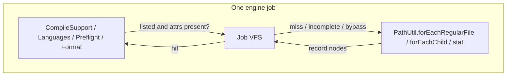

# Per-job virtual file tree (VFS)

How the engine remembers what it already learned about the workspace filesystem
for the duration of one job. User-facing engine knobs: [Engine](../user/engine.md),
[Config](../user/config.md). Process model: [Architecture](architecture.md).

This is the owner of “have we already listed this directory in this job?” It sits
**in front of** `PathUtil`, not instead of it. `PathUtil.forEachRegularFile` remains
the walk. The VFS is the memo.

## Why

A traditional-layout `jk build` asks overlapping questions of the same bytes:
language detection walks `src/`, collectors walk `src/main/java`, preflight
fingerprints all of `src/` again. `RequestScope` already memoizes
`(root, extension) → List<Path>` for some collectors; it does not share a parent
listing, and `Languages`, format, effort counts, and the Groovy worker do not
share it at all.

Re-walking a hot tree is cheap on Linux (dentry cache). It is not cheap on
Windows: `FindNextFileW` already returned attributes with the entry, and
re-resolving the path to ask again costs **10.3 µs** against **1.0 on ext4**
(see `PathUtil` javadoc). macOS sits between. The VFS exists so a job
pays that walk once per covering directory and reuses attrs the walk already
read.

The filesystem stays the source of truth. The VFS is a **job-scoped retain of
what this job already observed**, discarded when the `IoLedger` dies.

## Shape

One sparse tree per engine job (`JobEnvelope` / `IoLedger` / `RequestScope`).
Directory nodes intern path prefixes; file nodes hold a name, size, mtime
millis/nanos, and the regular-file bit.

**What ships:** `coverModule` is the first VFS touch. It recursively lists
traditional `src/` (compact: also `test/` and sibling suite dirs, without
`TestSuites.discover`). Nested `of(src/main/java)` is a prefix filter stored
under the nested key — never a second `load()` when that covering parent
exists. Extra-src roots that are not under `src/` or `test/` are their own
covering keys. `of()` never walks an ancestor named `src/` just because the
path contains that segment — a checkout living under `~/src/…` is not a
module root. `coverModule` is what establishes the covering parent.

A covering key is either a complete `Listing` or `Overflow` (stream the rest).
Callers that run after `coverModule` do not see a listed-but-not-recursed
node.



### Completeness flags (structural only)

After `walkFileTree` / `visitFile`, `BasicFileAttributes` arrive as a blob
(size, mtime millis, mtime nanos, regular-file bit). Do not store
per-field completeness (“I have size but not permissions”). The only honest
flags are whether the **structure** was observed:

| Flag | Meaning |
|---|---|
| `listed` | Direct children of this directory are known (depth-1). |
| `recursed` | The subtree was walked; every descendant file node exists. |

A caller that needs attrs on a node that exists uses them. A caller that needs
children of a directory that is not `listed` walks (depth-1 or recursive) and
records the result. A caller that needs a subtree of a directory that is
`listed` but not `recursed` walks only the un-recursed children.

Prefix reuse: `src/main/java` is a child of `src/`. After `coverModule` (or a
nested `of()` that walked the covering parent), `src/` is `recursed` and
`src/main/java` is a filter, not a second `load()`.

### What is never in the VFS

| Tree | Why |
|---|---|
| `target/`, CAS, plugin scratch, KSP, generated sources | This job writes them. `RequestScope` already refuses to cache mutables, and `InputTrees.of` answers any root with a `target` segment live on every ask — never retained, never charged, never memoized. The one carve-out is `target/tmp/`, the declared scratch root (`BuildLayout.tmpDir`): no build step writes there, and it is where a forked test JVM's temp root lives, so a name-only rule would call every `@TempDir` fixture build output. A `target/` tree *inside* a scratch tree is build output again. |
| File **bytes** | `FileHashMemo` owns content hashes, keyed on live `(path, size, mtimeMillis, mtimeNanos)`. |
| Toolchain installs, Maven store | Rarely change; not this workspace. |
| Plugin-worker heaps | Other JVMs. They receive `PluginProtocol.SOURCE` **paths**, not a tree snapshot. Proto stays 1. |

Bypass (read-through, do not record as input): output probes
(`classesDirHasContent`), `FormatFreshnessIndex` stats **after** format writes,
`CasPrewriter` polling live compiler output, `JdkFingerprint`, `SourceWatch`.

### Interning

One Java object per file at ~300–400 B does not fit a million-file module in a
256 MiB engine. Directory nodes intern path prefixes (the same reason Gradle
interns `RelativePath` segments). File nodes hold a name, size, mtime
millis/nanos, and the regular-file bit — not a retained `BasicFileAttributes`
NIO view.

## Lifetime

Born with the job’s `IoLedger`. Unreachable after `IoLedger.close()`. No
process-lifetime filesystem cache: the engine has **no idle timeout**, and a
cross-job tree is how `target/` and editor saves go stale.

`jk watch` is a new job (new ledger) per iteration.

After the job, an explicit `System.gc()` on SerialGC is allowed so a tens-of-MiB
tree does not sit until the next allocation spike. The contract is still
reachability, not the GC call.

Copy last-job VFS counters **before** `IoLedger.close()` (after close,
`RequestScope.current()` is `UNSCOPED`).

## Bound: heap vs retain are different knobs

A workspace — even one module — can be unbounded. javac/`@argfile` and
in-process Zinc have no file-count cap; the worker heap and compile time do.
The engine must not pretend a module with 200k resource files is illegal, and
it must not retain one node per file until the 256 MiB SerialGC heap dies.

Those are two different pressures:

| Knob | What it buys | What it does **not** buy |
|---|---|---|
| **`[engine] max-heap-mb`** / `JK_ENGINE_MAX_HEAP_MB` | Room for the coordinator **and concurrent jobs** sharing one engine. `CI=1` already raises the unset default 256 → 512 for this. | A bigger per-job file tree. Four medium builds on a 1 GiB heap still want small trees. |
| **`[engine] vfs-max-mb`** / `JK_ENGINE_VFS_MAX_MB` | How much of **one job** may be spent remembering input nodes. Raise this for a dedicated huge tree (hundreds of thousands of files) so that job stops re-walking. | More concurrent builds. A 256 MiB VFS on a 256 MiB heap is one job, then OOM. |

`CI=1` must **not** raise `vfs-max-mb`. The CI heap bump is concurrency
headroom; stealing it for a default 128 MiB tree would cap how many jobs that
engine can hold.

Raising `max-heap-mb` without raising `vfs-max-mb` leaves each job’s tree at the
default — that is the 1 GiB CI box running many ordinary builds. A third
pressure is **how many of those jobs are in flight at once**; that is not a
knob, it is a process-wide retain pool (below).

### Defaults

```toml
# ~/.jk/config.toml  — machine-scoped, not project-overridable
# Read at engine start (same as max-heap-mb / jobs). Not hot-reloaded.
[engine]
max-heap-mb = 256   # process -Xmx; 512 unset default on CI
vfs-max-mb  = 32    # per-job VFS retain; CI does not change this
```

| Value | Meaning |
|---|---|
| **unset** | **32 MiB** per job (~80–100k interned file nodes). |
| **`0`** | VFS **off**: no attribute tree is retained; queries live-walk, each distinct question once per request (the pre-VFS memo). Debug / A-B. Not “unlimited.” |
| **positive** | That many MiB of nodes this job may retain, subject to the process pool. |

Uncapped retain is not offered: that is how a generated dump under `src/`
kills SerialGC.

### Process-wide pool (the concurrent-job guard)

`InFlightBuilds` only rejects the **same** checkout+kind. Ten worktrees are
ten jobs, ten trees, and `HeapPlan` sizes **worker** JVM heaps — the lease ledger caps how many run — they
do not account for engine-heap VFS. Ten × 32 MiB = 320 MiB on a 256 MiB
SerialGC engine is an OOM; the per-job cap does not see it.

**Pool:** the live sum of every in-flight job’s retained VFS bytes must stay
≤ **75% of `max-heap-mb`**. The other 25% is coordinator headroom (module
graphs, journals, `FileHashMemo`, JSONL, SerialGC). 75% is a constant, like
`HeapPlan`’s 10% RAM buffer — not a user knob.

**Grow:** a job may record a node only when both remain:

```
min(per-job vfs-max-mb remaining, process pool remaining)
```

Bytes are **live**, not reserved. Do not admit-reserve `vfs-max-mb` or a tiny
job of 2 MiB would count as 32 and push a neighbour into streaming for no
reason.

**No request, no tree.** A caller with no ambient request (a pool thread that
pre-dates the job, a CLI-side helper) live-walks and never retains or charges —
there is no `finishJob` to return its bytes, so a charge there would leak the
pool for the engine's lifetime.

**New job, pool already full:** sticky **stream-only** for that job’s life.
It never allocates a tree. It does not wait for a tree to free, and it does
not start retaining mid-job (a half-built tree plus streamed walks is more
code than it is worth). Jobs that already hold nodes keep them until they
finish; their `IoLedger.close()` returns the bytes to the pool.

**Do not reject the job.** Exclusive-fingerprint “already running” is the only
admission refusal. Stream-only is slower on Windows, still correct, and the
engine stays up.

```
256 MiB heap  → pool 192 MiB →  ~6 jobs at 32 MiB retain, 7th+ stream
512 MiB heap  → pool 384 MiB → ~12 jobs at 32 MiB
1 GiB heap    → pool 768 MiB → ~24 jobs at 32 MiB, or 3 jobs at vfs-max-mb=256
```

One huge job with `vfs-max-mb = 256` on a 1 GiB heap takes 256 MiB of the 768
pool; a concurrent second huge job still has room; a fourth at 256 streams.
The same 256 request on a 256 MiB heap is clamped by the **pool** (192 MiB),
not by a per-job quarter-heap rule.

### When the budget is gone

Stop **retaining** new nodes. Serve further queries as streaming
`PathUtil` walks. Already-recorded prefix nodes stay (do not discard work, do
not compile the empty set). The build remains correct; it just re-walks the
unretained tail — once per distinct query per request, since streamed answers
are still request-scope memoized (path lists, not attribute nodes).

Compilers still receive the filtered source list (`PluginProtocol.SOURCE`). A
million `.java` files is a **worker** problem (and a “split this module”
problem), not an engine refuse-to-discover.

### Operator recipes

| Situation | Set |
|---|---|
| Laptop / default | nothing |
| CI, many concurrent medium builds | `max-heap-mb = 1024` (or rely on `CI=1` → 512). Leave `vfs-max-mb` at 32. The 75% pool is what keeps the 10th job from OOMing the engine (it streams). |
| One huge tree, dedicated engine | `max-heap-mb = 1024` **and** `vfs-max-mb = 256` (or 128). Restart the engine. |
| Suspect the VFS | `vfs-max-mb = 0` |

## Call order (the I/O win)

`coverModule` is the first VFS touch in `TaskForecaster` (before
`collectJavaSources`), `PreflightMemo.fingerprintModule`, and `PlannerSetup`.
Today forecast collects at `TaskForecaster` ~394 and resolves languages at ~406;
that order exact-shadows `src/main/java` and forces a second walk of `src/`.

Traditional covering root: `src/`. Compact: `src/`, `test/`, named suite dirs
**without** going through `TestSuites.discover`. Discover prefix-filters those
listings.

`Languages.anySourceUnder` reads the covering snapshot. **`WorkspaceClasspath`
missing-sibling probes only** use `PathUtil.anyRegularFile` — do not retain a
listing for an existence check.

G44 (`SourceScanBudgetTest`): `coverModule` first, then Languages + collect +
fingerprint → PathUtil walks of `src/` == 1.

## What still lives outside

`PathUtil` grows `forEachChild`, `forEachEntry`, `anyRegularFile` for shapes
the VFS does not replace: depth-1 (`AbiIndex` nested classes, JDK probes),
directory mtimes (`FreshnessStamp.newerThan`), existence short-circuit.

Walk skip policies stay three predicates (`WalkSkip.workspaceKey` /
`pathSource` / `formatSegment`). Do not add `out/` to workspace-logic cache
keys. Do not route format through `workspaceKey`.

Outliers that are not this tree: G37 deletes, `JdkFingerprint`, Quarkus
depth-capped hunts, `jrt:` `TypeIndex`, `CasPrewriter`, `SourceWatch`,
`AbiMemo.sweepResidue`.

Groovy: the set `ActionKey.forGroovyc` hashes **is** the `SOURCE` set. No tree
on the wire. Independent of the VFS.

## Observability

Per-job atomics on `RequestScope` (`noteVfsHit` / miss / walk / overflow /
bytes / nodes). Last-job totals on `status-ack` (proto 1, additive JSON),
copied before ledger close. Process-wide counters cannot prove “one walk of
`src/`” on a resident engine.

`jk engine status --output json` last-job fields (names indicative):

```json
"vfs": {
  "maxMb": 32,
  "poolMaxMb": 192,
  "poolUsedMb": 96,
  "nodes": 18420,
  "bytes": 6291456,
  "walks": 12,
  "hits": 40,
  "misses": 13,
  "streamOnly": false
}
```

`poolMaxMb` / `poolUsedMb` are process-wide (live in-flight sum). `streamOnly`
is this job: true when it started with the pool full, or `vfs-max-mb = 0`.

## Package

`cc.jumpkick.layout` (next to `TestSuites` / `Languages` / `ModuleLayout`).
Not `:host` — plugin workers vendor `:host` only and must not grow a tree
cache. Not `:config` — that owns `RequestScope`, which this uses.

## Non-goals

- Process-lifetime or persistent FS cache next to CAS.
- inotify / Watchman. Revisit only if a profiled build still spends wall time
  in `walkFileTree` of unchanged **input** trees after this lands.
- A visitor/decorator framework. Unique bits are predicates and collectors on
  `PathUtil`.
- Protocol v2 or a tree-snapshot JSONL type.
- Auto-scaling retain with `max-heap-mb` or `CI=1`.
- A user knob for the 75% process pool. Operators who want more concurrent
  VFS-backed jobs raise `max-heap-mb`; operators who want a bigger tree raise
  `vfs-max-mb`. The pool is the OOM fuse, not a third policy surface.
- Rejecting a job because the VFS pool is full. Stream-only is the
  degradation; exclusive fingerprint is the only admission refusal.
